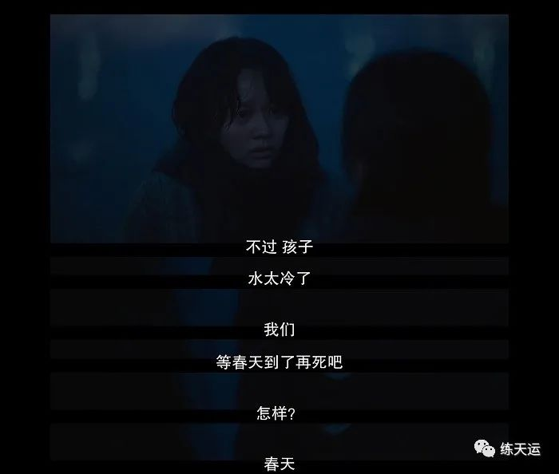

# 黑暗荣耀、王者荣耀
## 黑暗荣耀

今天，看了B站Up主木鱼水心解说的由Netflix推出的韩剧《黑暗荣耀》，总共两集，合并时长在三个小时的样子。

这是一部讲述遭受严重校园霸凌的女生（宋慧乔饰演），一步步忍辱负重，最终完成复仇的故事，我对它的评价是大快人心又发人深思，像校园霸凌的题材，把控不好很容易为了表现而表现，似乎拍摄者的目的都是为了让你对被霸凌者同情和对加害者的愤恨，这是最基本和浅显的，实际上这是一个相当好的题材，背后还可以涉及到教育、家庭、善恶、社会阴暗等多个令人深思的角度，一部好的作品就是在满足观众的感官享受之余，所探讨的话题又有足够的思想深度，既满足当下，又值得回味，强烈推荐给大家。

## 王者荣耀

不知不觉间，我已经超过一个月没有玩《王者荣耀》了，很奇妙，我没有什么大彻大悟，没有在某次超长游戏时间后顿觉浪费时间的悔恨，也从未励志说要发奋图强，发誓戒掉这些浪费时间的东西，它就是这么自然而然的淡出的我的生活，我不再产生打开它的兴趣了。

我所做的似乎只有一件事情，就是把时间花在了别的地方。

前几个月，我沉迷全民K歌，每天下班后的业余时间，几乎都花在了全民K歌上面，在这期间，还认识了不少唱歌好听、人也很优秀的朋友，这是一段很快乐的时光。半个月前，我开始决定写日记、并且有意识的加大了读书时间占业余时间的比例，自然的，唱歌也淡出了我的生活。

所以，我想如果你想戒掉什么，直接戒是戒不掉的，比较好的方式就是把你的注意力转移到另一件事上去，当然，这个也有一定难度，毕竟你要找到另一个让你觉得同等有趣/更加有趣的事情上，你才能愿意把你的注意力转移过去。

如果你不知道做什么，我建议你去读书，如果你不知道读什么，我建议读《马斯克传》、《曾国潘传》，这是近期对我给我影响很大的书（后面我会专门写文章分享这两本书）。我觉得人在年轻、迷茫的时候，可以多读读人物传记，不是要读他们取得了多么伟大的成就和给自己打鸡血，而是可以看另一种人生的可能、故事主人公跟你我一样有人之皆有的烦恼，他们对此如何应对，背后的决策依据又是什么。

你不必复刻他们，但至少可以看看他们。

## 写日记的意外影响

写日记这件事，产生了一些我意料之外的正面影响，不知道是写到第几天的时候，有个朋友（还是一位相当优秀的同学）竟公开发表说受我影响决定一起写，昨天，又有一个之前在深圳认识的朋友跟我说，要不他也写写？我觉得你不必犹豫，可以开始了图片。我觉得很受宠若惊，却高兴有人并肩同行，也希望他们都能从这个习惯中获益并一起坚持下去~