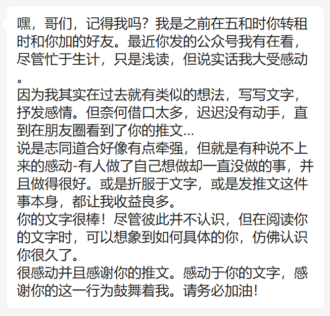
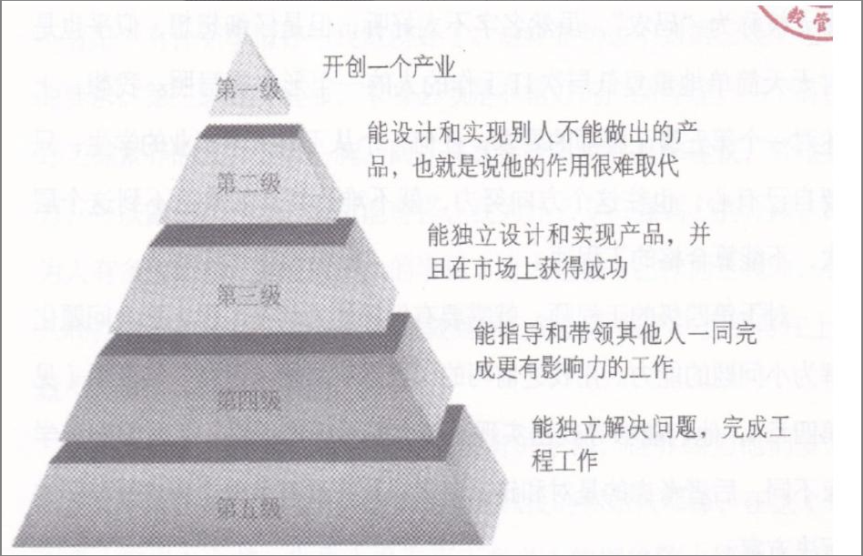

# 读者来信、工程师的等级

难得今日领导开恩，六点半即可下班，回到家便倒头大睡，将近十二点钟才起来。去厕所的路上稍微在客厅弄点动静，奶奶便敏锐的察觉到是我起来了，稍微陪她说了会话，她便告诉我餐桌上还有削好的水果，嘴里念叨着本来有一整盘的，现在只剩下一块了，如果我要她还可以起来削。

**真是神仙生活**。

醒来后，非常感动收到了一封读者来信：

非常感谢他的鼓励，我常常想我一定会成功，倒不是我对于自己有多自信，其中逻辑我在之前的文章中表达过类似的：怎么样才算失败呢？**对于做任何一件事而言，只有放弃算的上失败，只要你不放弃，从逻辑上讲所预留给你的可能性就只剩下把这件事做成，区别只是在于需要多长的时间、走多曲折的路。**

而我对此并不心急，再次总结一下：**不失败不等于成功，却只给你留下了成功的可能性**。希望这个结论，对也许正在做某件事的你，也有所鼓舞。对于我而言，做好长期默默坚持、忍受孤独的准备，当然是必要的，我不能依赖于外物去坚持，但这并非意味着外在的鼓励没有作用，恰恰相反，它们意义很大，因为**它们大大提升我在这条路上的体验并降低了坚持所需要的难度，换句话说，它们让我不那么容易失败。**

**再次，感谢善意。**

我常常想，我这些文字其实也是一种筛选，它会筛选那些不认同你的人。假如你在热爱生活，它会筛选掉那些对此嗤之以鼻的人，假如你在努力上进，它会筛选掉那些耽于享乐的人，从某个角度，它也会让你看清，你平常所谓的朋友，哪些人是真正的是在支持着你。

**逻辑的美妙常常让我沉沦**。

***

最近心有点杂，曾国潘有一个原则，一本书没有读完，坚决不翻开下一本。

而我可差远了，我同时在读三本书：《从房客到房东-人生首套房操作指南》、《WEB3.0：赋能数字经济新时代》、吴军老师的《见识》，并且还在给自己的书架上不断的添书：《操作系统导论》、《公众号运营实战手册：57招让你实现从0到10万+》、《终结阿尔兹海默病：全球首套预防与逆转老年痴呆的个性化程序》。

**有太多太多的知识想要学习，时间怎么会够用。**

不过同时读几本书确实是一个坏习惯：你会发现每一本都读不深入，频繁的切换会让你对每一本都没有很好的吸收，所以急是没有用的。另外，我尝试从《从房客到房东-人生首套房操作指南》这本书得到要不要买房的答案，最后却发现，还是从一开始在看的《见识》这本书得到了我想要的：

不买。父亲尝试提升我人生的下限，认为只要我咬咬牙上车了，长远来看，未来不论我发展的好不好，我至少有房有车，再怎么差也差不到哪里去了，而他已经替我解决了大部分的经济压力，我有什么可担心的，**感谢父亲的用心**。

但我今天想通了（也不算自己想通，书里面有类似逻辑的观点），人的格局可以更大一点，在人的早期应该专注于自身能力的成长，财富的增长是随着你的能力的增长自然而来的，年轻有为买房买车看似令人羡慕，但只不过是一个虚名，跟你的能力不匹配毫无意义。如果几年后，你的能力没有足够的增长，不过是让高额的房贷给你套上个枷锁，让你持续的不幸福，反过来，若你到时对自己创造财富的能力足够自信，根本无需在意早买房和晚买房在几年之间的那点房价波动的差距。

另外，也是今天在《见识》这本书中，读到一个关于工程师等级的分类方法，我觉得很有参考价值，想要分享一下：

> 以计算机行业为例，一个人毕业后，经过一段时间的锻炼，能够熟练应用工程的知识和技能解决问题，独立完成所分配的工作，而不需要他人指导，就算是一个合格的第五级工程师了。
>
>再具体一点，比如这个人在京东任职，老板让他开发一个工具，找出那些不断帮助女(男）朋友买书的读者。他自己知道在公司内找谁去要数据，如何确认两个人可能是男女朋友，而且经常买书；也知道自己在京东的环境里，应该使用什么样的开发工具，以及为了方便客户使用，这个工具应该有什么样的基本功能。
>
>如果做不到这件事情，算不上一个合格的工程师。在过去，工程师和科学家是可以并列的头衔，今天在法国和德国依然如此一那里的工程师会有一个特殊的资格证书，就如同医生和律师有特殊的资格证书一样。
>
>但是在中国，很多人从工科大学一毕业，公司就在他的名片上印上“工程师”，然后他就似乎巳经成为工程师了。但很多人有这个头衔，却并不具有工程师所应该有的基本技能。
>
>在IT行业，很多人被称为“码农”，虽然名字不太好听，但是仔细想想，似乎也是对天天简单地重复低层次工作的人的一个形象的写照。我想，上述对一个第五级工程师的要求，任何一个从工科大学毕业的学生，只要自己有心，也往这个方向努力，就不难达到。如果达不到这个层次，不能算合格的工程师。
>
>对于第四级的工程师，就需要有领导能力和在工程上把大问题化解为小问题的能力。用我之前写的“愿景一目标一道路”的逻辑（见第四章),他们能够寻找出实现比较大的目标的道路。工程师和科学家不同，后者考虑的是对和错，前者只是在现有条件下考虑好和坏的解决方案。
>
>比如在建造一座海湾大桥时，工程师会在现有资金的条件下，根据交通的需求设计一个200年使用寿命的大桥，但是为了让军队迅速通过一条河，他们追求的目标就变成了在最短时间内建造一座足够让军队安全渡河的浮桥。目标不同，工程师的解决方案就不同，这件事对于土木工程师和桥梁工程师来讲，常常不是问题，但是很多搞IT的人，常常会把海湾大桥修成浮桥，也会把浮桥按照海湾大桥来慢慢修。
>
>因此，能否成为第四级的工程师，要看能否最好地解决一个这样有规模的实际问题。这个能力远不是熟练写程序就足够的。很多人抱怨自己的机会不够，其实从管理者的角度看，中国IT公司里非常缺乏这样有头脑的工程师。至于为什么有的人能够得到机会，那是他们和上下级之间较强的沟通能力帮助了他们。
>
>对于第三级的工程师，就应该能够独立带领其他人做出一个为公司挣得利润的产品。这里面除了上述能力外，还涉及对市场的判断能力和营销能力。很多人讲，我就是做工程的，这个东西是否有用我不清楚，有什么事情你叫我做就好了。这样显然达不到第三级工程师的要求。
>
>第三级的工程师，本身必须是非常好的产品经理。一个有良好工程素养的人，如果心胸开阔，愿意接受各种意见和建议，经过努力，可以做到这一步。你可能奇怪，我为什么专门强调心胸开阔。因为人有多大的心，就能做多大的事情。有人抱怨自己作为工程师，收入和社会地位太低，我想如果你做到第三级就不低了。当然再往上，就不是很多人能够做到的。
>
>第二级工程师是能够做出先前没有的东西，世界因为他们多少有点儿不同。举几个例子，比如北极光风投的创始人邓锋，在他（和谢青、柯岩）之前，世界上没有真正意义上的网络防火墙设备，他们做出了这个设备，并且成功创立了当时世界上最大的防火墙公司（Netscreen）,这家公司在被收购前市值大约为20亿美元。他可以算得上是第二级工程师。另外，谷歌云计算的发明人杰夫迪恩（Jeff Dean）也可以算。你如果能成为第二级工程师非常好，但是如果不能也没有关系，不必对自己太苛刻。
>
>第一级是开创一个产业的人，包括爱迪生、福特、贝尔等人。这可能离我们远一点，是极小数人能达到的级别了。

从这个角度讲，我连五级工程师都够不上，因为在很多工程化的事情上，我还需要同事的协助。

我觉得应该有部分人面临跟我一样的困境，这可能跟国内的前端教育有关，在业界，前端工程化已经成了标准，但很多人所受的教育和场景让他们意识不到工程化的重要性，或许你百分之九十的时间都在处理页面和业务相关的逻辑，只有甚至不到百分之十的时间在于那些工程化的东西，但事情就是没有那百分之十就做不成，所以那些知识其实同等重要，而且那百分之九十的工作大部分人都能做（这话有点失偏颇，业务也是有难度和区分度的），你会不会那百分之十可能就是你跟别人的差距。

我以前很惊异，会问同事：“你们怎么什么都会？”，他们说：“你被逼得多，解决的问题多了自然就会了”。这当然是他们具有谦虚成分的说法，但也部分客观，我厚的下脸皮，搞不定的问题可以找他人解决，但也因此损失了自己的成长，而他们可能觉得没人可以帮他们，所以常常自己解决问题，并在这个过程中得到能力的增长。

在这一点，我需要向他们多学习。

