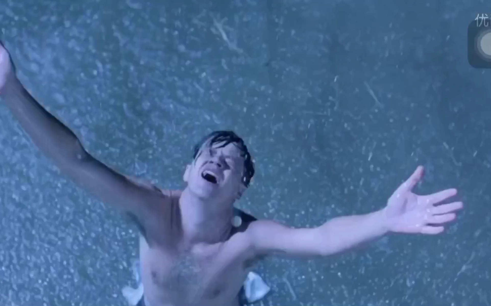

# 所谓兴趣爱好

曾经，我觉得自己是一个兴趣很广泛的人，喜欢打游戏、喜欢看电影、喜欢听音乐、唱歌、偶尔还看一下动漫、还一直标榜自己“**喜欢阅读**”。

这其实很可笑，大学里，假如一日无事，我每天起床第一件事，就是打开游戏，先玩到心满意足，他可能持续几个小时到一天不等，玩累了，就想着，玩点别的吧，这时可能看看综艺、看看影视剧，等到大部分的电子娱乐项目让我觉得累了，这时候我就会想起书籍了，于是便随便看一看，如若看进去了还好，可能能深度阅读一段时间，但大多数时候，还是草草看个十几分钟，就又觉得乏了，开始寻找新的娱乐项目。

**日复一日**，大学生活就这样过去了。

**那时我也不知道为什么要阅读，可能是之前的人生中什么时候在心里洒下过一颗种子，让我觉得这件事是必要的**，心里也隐隐知道书里有我想要的一切，但或许是逃避，不愿去深想和正视，就使它一直在我的爱好里占据着边缘化的位置，从未放弃，却也从不重要，但可笑的是，只要与人聊起兴趣爱好，我就会告诉他，我爱好阅读，给人一种这是我的主要爱好的感觉，贪图它的逼格，过度的美化了自己，实在惭愧，**不过可能这代表的，也是一种我心的憧憬的自己吧**。

但不管怎么样，即便是在其他的爱好方面，我也会兴许带有一点欺骗成分的告诉自己，我要把这件事情也认真的做好。我的游戏水平并不差，玩王者荣耀的时候，我是荣耀王者的水准，巅峰赛两千分的水平，玩炉石传说的时候，最好的成绩是国服传说前一百名，参加过线下的全民实力赛，打到了前八名，**就是这些成绩，给了我一些虚假的满足感，其实我心里一直都知道，自己与“顶尖”这两个字的距离犹如天堑**，尤其是在看一些主播的时候，更加会有一种深深的挫败感，但有时那又是一种激励，渴望自己也能玩得如他们一般好，这时候又会去打开游戏，尝试自己去也能像主播一样大杀四方，直播间对这种行为有一个很有趣的梗来描述：此时一位靓仔打开了王者荣耀，六分钟后回到了直播间（在这个游戏里最少需要六分钟才可以发起投降）。

其实大多数时候，玩游戏，就是在玩而已，所谓的上进，是一种可笑的自欺欺人。但这时看着自己似乎在一个小圈子里，哎呀好像比他们玩的可以，王者荣耀继续用数据欺骗你，你能达到这个水准，已经超越了95%以上人的游戏水准了。

这个游戏有1.2亿的月活，5%就是600万，天哪，达到顶尖，需要在这600万人之间脱颖而出，即便一个人有极高的天赋，再辅以正确的练习方法，真正有所成就的又能有多少呢？在这样一种竞争面前，顶尖的天赋和不懈的努力恐怕都还远远不够，还需要极高的运气。

不过稍微一想却觉得非常合理，像这种一种既可以打游戏，又能赚取财富与风光的事情，可不就竞争激烈吗？

而像我这种天赋也平平，只够在小圈子沾沾自喜的人，还花费大量的时间在这里，妄图“小有成就”的人，就实在是显得非常可笑了。可惜当时我不会这么想，更没有像刚刚那样去做过数据分析，**人很可怕的地方就在于惰性，沉湎于一个令你快乐的事物的时候，你是真的可以一直乐不思蜀的**。

当然，上面的角度，是比较功利性的，其实**游戏还有艺术性的一面**，为什么我们会喜欢看那些顶尖的主播呢？当他们拿着丝滑的露娜整个地图随意横漂、拿着镜、澜等英雄移形换影的时候，其魅力何在？很简单，**一门技术，一旦做到极致，就成为了艺术**。技艺技艺，中国的天生就有这么一个奇妙的词，来表明这两者似乎先天就存在关联，我曾经读过一本书，叫《黑客与画家》，是阮一峰老师翻译的，当我看到这边书的书名的时候，感觉非常奇怪，这两个职业为什么被并列的放在一起作为书名，他们看上去毫无关联性，看完后我明白，原来，在真正的热爱编程、并把计算机技术钻研到极致的人眼里（即黑客），计算机的程序设计、产品细节的雕琢，是一门艺术，在作者看来，这是一种创造性的活动，就如画家作画一般，是一种艺术。

人类的慕强是刻在基因里东西，因为那些强者，能用他们的技艺，**带给我们一种极高的艺术享受，触达我们的每一个感官，让我们迷醉、甚至痴狂，沉浸其中实在是十分美好的事情。**

有时候，甚至都不需要玩，仅仅是游戏的设计就让我被其中的巧妙所惊叹。炉石传说就是这样一款游戏，在这个游戏里，有各种各样的卡牌，这些卡牌被分为随从牌和法术牌，随从拥有各种各样的种族，每个种族都有其独特的特点，法术牌则拥有各式各样的强大的一次性效果，玩家需要从十一个职业里，选择一个职业，选择30张卡牌组成一套套牌去与其他玩家对战，相应的，每个职业也有其特色，正是因为拥有如此丰富的元素，所以从数学上，它们可以产生无数的排列组合，并构建出各式各样好玩的套牌，而在对战过程中，玩家需要则需要运用充分运用自己的智力，去最大化发挥每张卡牌的效果，再结合一定的随即效果，可以给人无与伦比的游戏乐趣和体验。

像这种，则是因为人类的创造力，让人觉得体会到快乐和美好。

电影也是一样，我想大多第一次看《肖申克的救赎》的人，都应该被电影中的这一幕深深震撼过。

我看到的，是一个**关于隐忍和热爱的故事**，当生活给你难以想象的重击的时候，安迪没有怨声载道，而是接受了这一切，当27年后，他从下水道爬出去重获天日的时候，我想没有谁不被这部电影所传达的精神力量所震撼，一定是刻在骨子里的热爱生活，才能让他始终没有放弃对于未来的希望。

当然，其实好电影非常少，但是依旧会让你产生一种，想要有所期待和探寻的欲望。

音乐、舞蹈、动漫等等其他的艺术形式就不一一陈述了，其魅力想必已不言自明。

总而言之，时代发展到现在，已经有足够的艺术形式、眼花缭乱的选项供人去选择和沉醉，它们往往都让喜欢他们的人感觉美好，但又不完全一致，每一个爱好都有其自身独特的特点和魅力，吸引着不同类型的人。

**所以，我如今依然会标榜自己是一个兴趣爱好广泛的人，因为这世界确实是足够精彩和美好的。**

**但这样有个问题，那就是时间是有限的**。

所以，这篇文章本来是取名叫“生活的减法”的，也是本来想讲的主旨，谁知道上面的写了这么多，所以就改个标题先发一篇，明天再以此文为引，继续写吧。
