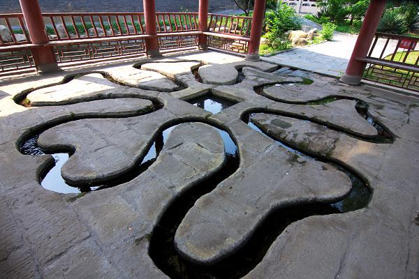

# 再读《兰亭集序》:王羲之的伤感

上学的时候，我没有好好学习，很多古文作品，都没有用一种学习思想的态度去阅读，大多数时候，只是为了把这篇文章记住。

近期我重新重视起了自己的语文教育，在读《阅读与写作讲义》这本书的过程中，吴军老师带我重新品读了这篇文章，不过他的讲解还是比较概括性的，但对于我来说足够了，因为它勾起了我要精读这篇文章的欲望。

花了好几个小时，感觉收获非常多，本文把这些收获记录并分享出来，相信你看完，也一定会以一个全新的视角看这篇文章。

先贴原文:

永和九年，岁在癸丑，暮春之初，会于会稽山阴之兰亭，修禊事也。群贤毕至，少长咸集。此地有崇山峻岭，茂林修竹；又有清流激湍，映带左右，引以为流觞曲水，列坐其次。虽无丝竹管弦之盛，一觞一咏，亦足以畅叙幽情。

是日也，天朗气清，惠风和畅。仰观宇宙之大，俯察品类之盛，所以游目骋怀，足以极视听之娱，信可乐也。

夫人之相与，俯仰一世，或取诸怀抱，悟言一室之内；或因寄所托，放浪形骸之外。虽趣舍万殊，静躁不同，当其欣于所遇，暂得于己，快然自足，不知老之将至。及其所之既倦，情随事迁，感慨系之矣。向之所欣，俯仰之间，已为陈迹，犹不能不以之兴怀。况修短随化，终期于尽。古人云：“死生亦大矣。”岂不痛哉！

每览昔人兴感之由，若合一契，未尝不临文嗟悼，不能喻之于怀。固知一死生为虚诞，齐彭殇为妄作。后之视今，亦犹今之视昔。悲夫！故列叙时人，录其所述，虽世殊事异，所以兴怀，其致一也。后之览者，亦将有感于斯文。

先说结论：**这篇文章，除去它被称为“天下第一行书”的书法价值外，仅仅从文章本身而言，也是一篇思想性非常好文章，而全文仅有324个字。**

接下来，我就带着大家解读一下，看看这篇文章讲了什么，思想性好在哪里，另外，阅读文言文本身是一个很好的补充历史知识的过程，因此，在领读的过程中，我也会把这些我学到的知识点讲解一下。

译文如下：

>永和九年，岁在癸丑，暮春之初，会于会稽山阴之兰亭，修禊事也。

永和九年，是公元353年，距离今天1670年了，暮春，自然是指春天的末期，我突然发现我都不知道春天是什么时候？

这里补充了我的第一个地理知识点：

我之前一直以为，春天就是阳历的一至三月，原来不是，应该是按照二十四节气分的。

二十四节气在秦汉时期就已经确定了下来，可以理解为地球每公转15°就算一个节气，古人当然不知道黄赤交角的存在，他们仅仅通过观察和总结就创造了这一套系统，二十四个节气均分到四个季节，就是每个季节六个节气，每个节气有个命名和含义，这个含义往往是概括这个点的降雨、气温等天气特征，用于指导农业，春天，是指从立春到立夏之间这段时间，对应的节气如下：
>立春时间农历十二月（大）廿二
>
>雨水时间农历正月（小）初七
>
>惊蛰时间农历正月（小）廿二
>
>春分时间农历二月（大）初八
>
>清明时间农历二月（大）廿三
>
>谷雨时间农历三月（大）初九
>
>立夏时间农历三月（大）廿四

这篇文章写的具体时间，也是有交代的，怎么交代的呢？就在于这个“**修禊事也**”。

>修禊，古代的基本祭祀之一，在每个月的“除”日举行仪式进行祭祀，可以扫除恶煞、去旧迎新。魏朝以后，定于农历的三月初三。

也就是说，这篇文章写于农历的三月初三，这时候距离立夏的三月廿四只有二十多天了，所以是暮春。

会稽郡山阴县都是古代地名，现在在浙江的绍兴，兰亭在如今的绍兴市柯桥区兰渚山下。

整句的意思就是：**353年农历三月廿四这一天，（我们）聚集在会稽郡的山阴县的兰亭这里，为了修禊这件事情。**

**地理真的很重要，否则读故事的时候，连时间地点弄明白都要搞半天。**

>群贤毕至，少长咸集。

这个群贤不是什么客套话，因为王羲之出身于名门望族，社会名流，又是知识分子，圈子的逼格当然很高，所以群贤确实就是指今天来的都是文化人，一共四十一个人，年轻的年老的都有。

>此地有崇山峻岭，茂林修竹；又有清流激湍，映带左右，引以为流觞曲水，列坐其次。

环境描写，写兰亭这个地方有高耸的山峰，茂盛的树木和竹林，也有清澈但流速很快的激流。

这里先澄清一点，兰亭不是一个亭子，而是一个园林，是王羲之住的地方，这个活动是王羲之请别人到家里来进行的。

映带左右的意思就是这些溪流是环绕在兰亭园林的周围的。

接着介绍“流觞曲水”，它其实是一种游戏，并且需要道具，大概长下面这样：

游戏规则是这样的：

> 玩家挨着这些水渠排列坐好，从上游放一个酒杯，让这个酒杯自由流动，停在谁面前，谁就要喝一杯酒，并作诗一首，作不出来，就罚三杯酒。

**我感觉还挺好玩的，把作诗改成真心话大冒险套进去就可以了。**

所以“引以为流觞曲水，列坐其次。”的意思就是，他们把外面溪流的水引流到到它们玩“流觞曲水”这个游戏的地方，排列坐好，开始玩游戏了。

>虽无丝竹管弦之盛，一觞一咏，亦足以畅叙幽情。

虽然旁边没有乐队助兴，但是这样一杯酒一首诗，也是很爽的，人嘛，喝了酒以后就容易表露感情，而且他们是文化人，感情还比较细腻，所以“畅叙幽情”的意思就是，在这样一个场合下，也足够大家都敞开心扉畅快的表达一些内心一些比较幽深的情感了。

>是日也，天朗气清，惠风和畅。仰观宇宙之大，俯察品类之盛，所以游目骋怀，足以极视听之娱，信可乐也。

介绍完环境，介绍今天的天气，毕竟是户外活动，王羲之就说了：

今天天气非常好，阳光和煦，微风习习。

抬起头看天空，视野广阔，万里无云。

低下头看看地上的东西，又种类繁多，万物茂盛。

像这样一个场景，玩的开心，风景又好，玩的人心情就会非常好，这两个是相互促进的，所以王羲之眼睛看到的都觉得是美景、耳朵听到的都觉得很动听，所以他说“信可乐也”，也大白话说就是：“太开心了。”

> 夫人之相与，俯仰一世，或取诸怀抱，悟言一室之内；或因寄所托，放浪形骸之外。虽趣舍万殊，静躁不同，当其欣于所遇，暂得于己，快然自足，不知老之将至。及其所之既倦，情随事迁，感慨系之矣。向之所欣，俯仰之间，已为陈迹，犹不能不以之兴怀。况修短随化，终期于尽。古人云：“死生亦大矣。”岂不痛哉！

这一段开始，是**一个王羲之情绪的转折点**。为什么会发生这个转折呢，其实我们仅仅从情绪的自然流向就很好理解。

你可以设想一下，**当你处在一个风景非常好，并且当下的情境令你心情极度舒适的状态时，就是我们俗称的“陶醉”状态，而在这个状态过去稍微退却，理性回归，余温尚存的时候，人的第一感受是什么？是虚无**。

于是这个时候，“悲”这种情绪就可以会来临，因为“美好”即将要消逝了。

《兰亭集序》写于今天的什么时候呢？写在这个活动快结束的时候，《兰亭集》就是今天这个游戏里所有文人一起写的诗，一共37首，大家一商议，干嘛不出本诗集呢，众人一拍即合，随后，又怂恿王羲之作为活动的主办方，为这本诗集作序，这就是《兰亭集序》的由来。

所以，我们可以看出，活动接近尾声，那么今天的快乐也就将要“结束”了。

其实，这种集合了旅游和社交的快乐的活动，我们现代人也有，但与文化人的区别就在于：

**他们的情绪更为细腻，感受力更为丰富。**

**文人从来都是多愁善感的，而且，他们还具有足够的能力，把他们所善感的丰沛感情的融入他们的文字里，那些文字，并不会随着时间的流逝而失去感染力，千百年后，依旧可以感染着后来的读者。**

接下来，我们就看看，他所伤感的是什么：

**人与人之间互相交往，很快一辈子就过去了。**

**有的人在心怀抱负，一生都在追求志向；**

**有的人寄托于自己的兴趣爱好，放荡不羁的生活。**

**虽然形式各异，但相同的是，当人们遇到自己能取悦自己的事物的时候，自身得到满足，这种状况下，很容易感受不到时间的流逝，都不知道衰老正在来临。**

**等到对喜欢的事物厌倦了，再开始审视自身周围的境况，这时年纪大了，世界也变了，感慨自然也随之产生了。**

**过去所喜欢的东西，转瞬之间，就只剩下一些旧时的痕迹，这怎么能不让人有所感叹？**

**况且寿命的长短听凭造化，最终都会终结于死亡。古人说：“死和生毕竟是一件大事！”。**

**想到人生命的短暂，怎么能不让人悲痛啊？**

这一段的的描写极为感性，而且这个情感的产生非常自然。

**从如此快乐的一天的结束，自然而然感慨到人生的所有快乐都会因为生命的短暂而很快结束，是非常连贯自然的，也因为这种连贯性，读者很容易跟作者共鸣。**

**因为任何真挚而非矫揉造作的感情，都是非常的打动人的。**

**而且他所感慨的时光和生命的短暂，也是人类亘古不变的话题，即便在人均寿命远高于古代的今天，人们依旧会有人生短暂的伤感。**

而且他的论证方法也很巧妙：

他只列举了两种情况，就很好的表达出“人各有各的活法”这一点，但他并不对任何一种活法加以评论。

他从中提取了共性，那就是不论是“哪种活法”，人们必然都是因为他们的选择令他们快乐。

但不论是哪一种活法所带来的快乐，都逃脱不了这种终将随着生命短暂而消逝的宿命，从这个层次讲，你可以很好的体会到这种情感背后的底层逻辑：**对人生和生命发生内心的热爱。**

>每览昔人兴感之由，若合一契，未尝不临文嗟悼，不能喻之于怀。固知一死生为虚诞，齐彭殇为妄作。后之视今，亦犹今之视昔。悲夫！故列叙时人，录其所述，虽世殊事异，所以兴怀，其致一也。后之览者，亦将有感于斯文。

每当我看到古人发出这种和我现在的心境契合的感慨时，没有一次不是对着他们的文章感伤落泪的，但我心里又从来不能很清晰的把这种情绪表达清楚。

不过起码知道，把生和死、长寿和短命等量齐观是很荒谬的，生命长一分自然就有长一分的快乐。

后人看待今天的我们，也会像今天的我们看待这些古人一样吧！太可悲了（意思就是这种生命的局限一直存在，无法解决，传达的是人类共同的情感）！

所以今天我把众人所作的诗篇记录下来，即使以后时代变了，事情也不一样了，但是触发人们这种情绪的原因，应该还是一样的吧。后人读到这些诗的人，也会对着这些诗文、也会发出类似的感概。

这段的情感表达跟上一段是一致的，但比起上一段，**作者推己及人，意识到，这大概是每个人心中的悲痛，这种推己及人是“跨越时空”的，即任何一个时代的任何一个具有他此刻这样发自内心热爱生命的心境的人，大概都会有相同的悲痛。**

这里再另外提一下，“一死生，齐彭殇”这个观点，是庄子的思想，原句出自庄子的《齐物论》：“**天下莫大于秋毫之末，而大山为小；莫寿于殇子，而彭祖为夭。**”

但这句话是否要按“生和死、长寿和短命是一样的”去理解，这个我不知道，因为《齐物论》本身是哲学作品，比较高深，我觉得应该不是这么理解，我估计王羲之的理解也是主观的，不一定就是庄子的本意。

全文的解读到这里就结束了，可以看出，**王羲之是很感性的**，至少从这篇文章的感知来看是这样，而他这篇文章所传达的情感，又**确实是人类亘古以来共有的情感，至少我是深深的跟他共鸣了，而且这种情绪是无法消解的，就像他说的：“你这一辈子怎么快乐的过都好，最终还是不可避免的走向结束的。**”

不**过尽管如此，我想那些发自内心热爱世界的人，应该还是会尽力去享受生命的每一刻吧。**

这里就不对这个问题继续延展思考了，因为再谈下去就谈人生活法之类的哲学了，读者可以自己思考下，怎么面对这个问题。每个人的答案应该都有所不同，但我想应该各有各独特的理由吧。

最后在谈一点，现代人也有郊游，为什么王羲之却可以从中有这么大的感悟，并可以写出情感如此细腻的文章？

这就是文人的魅力之一：

**拥有丰富的感受力。**

**每一个人类，作为有情绪的个体，应该有个共有心愿，就是自己的人生拥有更加丰富的情绪和体验。**

**但即便是对于同一件事情，事物的体验在不同的个体之间，也是有差距的。**

**感受力更强的人，对于同样一件事情，却可以得到更多的体验和情绪。**

**这种感受力怎么获得呢？**

**其实不在于你去过多少地方，经历过多少事，而在于你对人类的共情能力有所少。**

**这个能力，是可以提高的，方法就是多去感受。**

**尽管围绕这个目的可行的方法可能不是唯一的，但最高效的方法，我想还是通过阅读文学作品。**

**因为人为创作的作品本身，因为存在创作的性质，就有刻意在加强读者共鸣的创作目的存在。**

**而当这种能力提高后，再应用回生活之中，那么很多相同的事情，你的体验想必都不再一样了。**