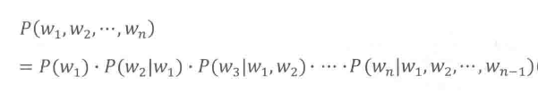
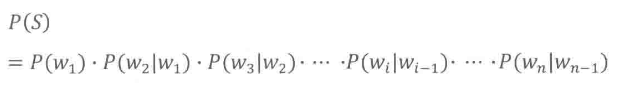

# chanGpt如何翻译句子？谁是吴军？

2018年，那时我还在上大学，并利用暑期的时间，到了一个校外的培训班学习，培训时间持续四个月，可是我在未学满两个月时就退学了，时至今日，我已经记不太清当时的培训时学过的内容如今还剩下多少了，这两个月的旅程里，真正让我印象深刻的，是另一件与所学专业知识毫无关联的事情——有一节课上，讲师不知什么契机突然向我们推荐了一本书:《数学之美》。

那时我虽然并不太爱看书，但因为我本身对数学具有一定的兴趣，而这本书的名字《数学之美》便引起了我的好奇心，再加上是老师推荐，所以我很快便翻开来看了，那是我在这次培训经历里**做的最正确的一个决定**。

这本书的前几章主要讲述了一个什么问题呢——自然语言的翻译问题。

在计算机出现后，人们自然而然就开始琢磨这个问题——机器能否理解自然语言？

然而在早期，人们的思路都是一样的，就是尝试用计算机模仿人类的理解语言的思维习惯，即学习语言的语法规则，比如说我们人类理解一个句子：

“我喜欢你。”

如果让你尝试解读这句话的含义，你会很自然的将这句话分为“主语”、“谓语动词”、“宾语”、“标点符号”，这些就是“语法规则”，这是一个比较简单的句子，但任何一个合法的句子，必然都是有其特定的语法规则的，于是早期的人们设想的解决方案都是——利用计算机表示这些语法规则，当计算机拿到一个句子后，它会尝试用它的文法规则解析器去解析这个句子，分出哪些是主语、那些是谓语等，然后根据分析结果理解这个句子。

这个方法，在经过了20年的发展后，很快就遇到了瓶颈，因为我们仅仅凭借直接就可以判断——句子的是可以很长很复杂的，比如说：

县乡联合工作组在今年10月底前要逐个村“过筛子”，对每个村（社区）“两委”班子运行情况进行深入分析研判。

像这样的句子，要去拆分出它的组成单元可就复杂多了，总而言之，这种让计算机基于匹配规则去识别句子的方法，发展了20年，依然只能识别一些简单的句子，句子稍微复杂一些便无法理解。

何况，人类还不一定会按语法规则来说话，并且，人们的语言的含义有时还跟上下文有关，同一个词在不同的上下文下会有不同的翻译，举个书中的例子：

“The pen is in the box”和“The box is in the pen”的翻译分别是“笔在盒子里”和“盒子在围栏里”。

懂得pen这个词的两个语义的人，很容易根据语境把这个句子翻译正确，但是基于规则匹配的计算机，即使让它把主谓宾给分出来了，它也无法联系上下文去区分出语义。

所以，尝试让机器模拟人的思维过程去理解句义的尝试，始终有很多问题无法解决，经过了多年也没取得多大的进展。

后来，有一个叫“贾里尼克”的人，在1970年在谷歌成立了一个团队，尝试解决“语音识别”问题，而他本人是一个数学基础非常好的“通信专家”，所以，他解决这个问题的思路跟以往所有人的做法都不同。

他想：“为什么要让机器像人一样去理解呢？这完全可以简化为一个数学问题。”

对于一个句子，我们要判定它的单词如何排列是合理的、哪个词应该跟哪个词连接、理解，全都可以表示为概率问题。

举个例子，就拿一个网络流行语“喜闻乐见”来说，这甚至都不是一个成语，而是一个现代才被发明的网络用语，你让机器怎么去区分出这四个字组成了完成的一个词呢？传统的分词方法根本无法覆盖这种语言现象，但我们只要换一种思路，这个问题就很容易解决：

我把全网的文献都查一遍，接着我发现，非常的多的文章都把“喜闻乐见”这四个字搭配在一起使用，比如说“小明喜当爹，小张对此喜闻乐见”、“全国人民都对娱乐明星的瓜喜闻乐见”，这两个句子里，“喜闻乐见”的前面几个字是不一样的，但是他们在不同的句子里都被搭配在一起使用，那么我们可以认为在第一个句子里“喜闻乐见”是一个词的概率就比“张对此喜”是一个词的概率更高——因为其它的文章也是这么用的，虽然此时计算机仍然不知道这个词什么意思，但是他却可以很好的识别出一个句子里，应该怎么拆分这个句子了。

上面这个案例虽然非常简单，但是我们却可以很少的体会到其中的妙处：**我们尝试引入了数学思维，利用概率去解决具体问题**。

所以，在这样的数学思维指导下，再加上贾里尼克良好的数学功底，他就针对解决这个问题建立了完备的数学模型。

什么叫数学模型呢?

我刚刚对于那个案例的描述是口语化的，但实际上，它可以用非常具体的数学公式表示。

还是拿刚刚的“我喜欢你”举例，这里面的三个词可以变化一下排列组合“喜欢你我、喜欢我你、我你喜欢”等，这些排列组合在文章里都有可能出现，那么哪个排列组成是合理的句子的可能性更高呢？

就可以这样去表示：

P（S） = P（w1*w2*w3...wn），其中P（S）表示某个句子的概率，右边的w1-wn则分别代表特定的词按特定的顺序排列的概率。

一个句子的概率，就等于第一个词的概率 * 已知第一个词的情况下，第二个词出现的概率 * ...以此类推，这种已知一件事发生，描述的第二件事发生的概率的概念，我们在高中数学就学过，就是**条件概率**。

所以，上面的式子就可以表示成：

像这样，我们通过一个数学的公式，就描述了一个具体的问题的数学表示，这就是数学模型。

当建立了某个问题的数学模型后，这个问题下的任一具体问题就可以用这个模型来表示了。

不过，如果一个句子非常长的话，上面那个计算也会变得很复杂。

所以，人们就想，有什么办法可以优化它呢？

这个问题的解决者，是一个俄国的数学家，叫马尔可夫。

它的优化思路也很好理解，即对于任意词出现的概率wi，我们不用看前面所有的词，只看前面i个数出现的概率就好了，这样计算量就大大减少了，而且效果也不错。

从宏观上来也很好理解，对于一个长句，出现在句子末尾的词跟句子前面的词出现的相关性已经不大了。

所以，数学模型就改进成了这个样子：

这样一来，计算机的计算量就大大减少了。

接着我们发现，这个i选多少，其实我们也是可以改变的，如果是2，则说明只跟前两个词相关，如果是3，则说明跟前三个词相关，我们很容易判断出，i越大，准确率越高，但计算量也越大。

对于技术原理的介绍部分就到这里。

接下来要讲的当我读到这些知识后的感受——**我是真的叹为观止，这个世界上怎么会有这么美妙的事情，有这么聪明的人**。

上面的案例虽然都不复杂，但是却极大的增进了我对于“机器学习”这个概念的理解，“机器学习”领域常常提到的概念“训练模型”、“大数据”等，在这样一个简单的案例里，含义都很好的得到了诠释，也很好的体现了这种解决问题的思路的巧妙之处在哪里。

理解了这些概念，你自然就明白了“为什么人工智能需要大量的数据进行训练”、“为什么再精确的模型都无法达到100%”这些问题。

所以，当我理解了上述的内容后，便可理解为什么这本书叫做《数学之美》，它也绝对无愧于它的这个名字。

多年后，当我开始广泛阅读后，第一个想起的就是这个这本书的作者的作品，他很厉害，具有讲复杂概念通俗化讲解的能力，后来，他不仅仅局限于讲解技术，对于历史、信息论、人生智慧、个人成长等多个方面，都出版了相应的书籍，向世界分享者他的所学所感。

本文中提到的著名现代通信专家——贾里尼克，就是这个作者在读博士期间的导师。

这个作者的名字，叫**吴军**。

