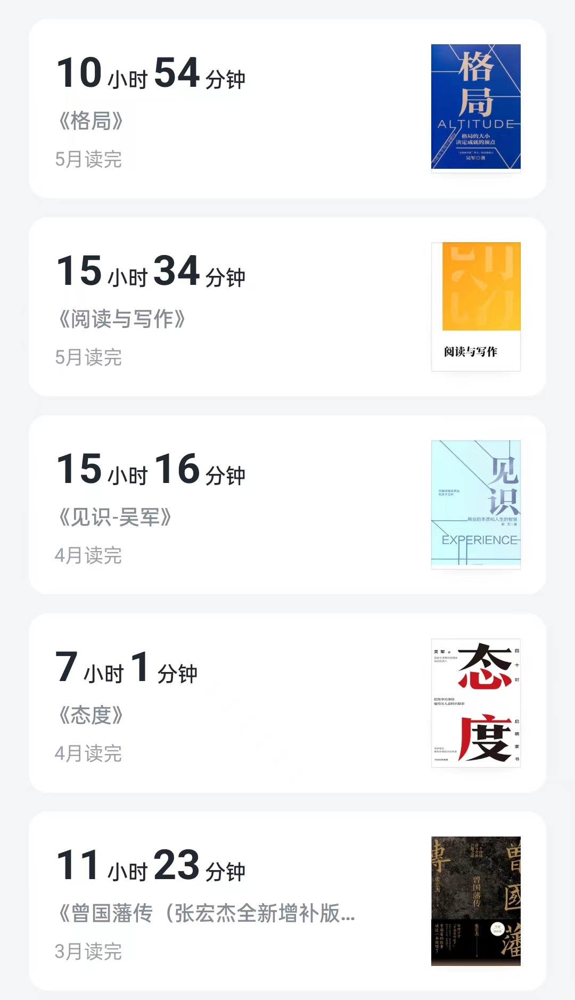

# 2023年3月~5月总结

人不能兀自往前走，时不时要停下来回头看看，以免方向错了，需要及时调整。

从3.13开始发公众号到现在，两个多月的时间，两个多月长吗？不长，从2020年7月毕业，到如今已经过了接近三年的时间，三年，足足可以拆分成18个“两个月”，所以这两个月，不过是十八分之一而已，并没有什么长的。

可从另一个角度看，又很长，感觉这两个月做的事情比前面17个“两个月”加起来还要多。

这当然不是事实，可是我的感官上确是如此感知的，大抵是因为这两个月确实比起之前作了很多的改变。

我们分主题来概括一下：

### 阅读

3、4、5月的阅读数据如下：

其中，读完的书有：

基本全部都是吴军的书，不过吴军一共有23本书出版，我到目前为止看完的也不过4本，离全部看完的目标还差很远。

从数据上看，还可以，这两个月的阅读时长加起来已经接近我去年的一整年的四分之三了。

如果不是现在统计一下，我也不会知道这个事情。

这几本书中，只有《阅读与写作》一本是具体的教授某个技能的书，这本书的收获也是最大的，它对我而言有两个作用：

1. 树立了系统的写作观、对写作的训练方法、基本写作手法、各类型写作题材等建立了一个概念的认知，不过，我对践行其中的知识还有所欠缺。
2. 给我提供了一个经典文学的阅读清单、包括唐诗、宋词、元曲、红楼梦、各国代表作者、代表作品等，并提供了一个阅读它们的作品的时候的思路，虽然我现在还没有时间去读。

另外四本，大抵都是关于一些人生智慧的书，当然，人生智慧这个主题太泛，而这些书的展现方式各有不同。

《曾国藩传》是通过人物传记的方式，对我而言，最大的促进，就是我直接受它影响，开启了写日记这个习惯，进而促进了我的写作这个习惯。另外，也是因为曾国藩，时时刻刻提醒我，人要踏实、“尚拙”。

《态度》则是一本家书，对我而言，最大的帮助就是我学会了这种沟通方式，虽然我还没有给家人写过信，不过在跟父亲的沟通上，我已经尝试过写一些长段的文字了，另外，我写作隐含的目的之一，就是我的父亲和弟弟是我的忠实读者，它们本身可以通过我的作品更好的了解我，这在某种程度上，也是一种沟通，现代社会的普遍问题之一就是，人与人之间接收的信息相距太大，哪怕同处同一屋檐下的人，也可能并不相知。

《见识》则书如其名，上半部分主要讲述一些商业模式的本质、一些商业现象背后的原理等，确实很大的拓宽了我的见识，比如说，我之前写过的“没有选择的好处”一问，就来源于这本书。

《见识》的下半部分和《格局》则都是一些具体道理的论述了，涉及的非常广泛，沟通、阅读、教育、职场等方方面面，其实这种散乱的内容反而不利于人记忆，专注于将一个主题的东西、因为始终存在一条主线，读者因为始终专注于这条主线，最后印象就会比较深刻。

### 写作

我写作的全过程，除去几篇投稿了的作品、和一些草稿，都已经完完全全的展示在了公众面前，毫无遮掩和保留，具体的产出就是公众号目前发布的63篇文章。

这些文章涉及的话题非常的广泛，大部分是关于我对某些事物的思考和看法、部分是我关于写作这件事本身的、部分是某些技术概念的讲解、还有些则是我的一些日常片段堆砌而成的日记、以及少量非原创的吴军老师的文章分享。

而那些看法的部分，聊的也非常广泛、有些关于金钱、有些关于两性关系、个人成长等等。

非要用一个字形容的话，就是“杂”。

这些文章有什么意义呢？

这个要看上限和下限，我这里只聊下限：

1. 如刚刚所说，是周围人了解我的一个途径，对于我的家人尤其有意义。
2. 是我留给这个世界的作品，虽然人微言轻，但毕竟是作品，作品是有可以享受时间的复利的东西，像陈酿一样会持续的散发酒香，慢慢扩大它的影响力。
3. 以前我对于某些事物的看法可能是模糊的一些关键词，通过行文，则让我对这个事物的看法有了完备的论述逻辑。
4. 我想我的写作能力应该也是每天都有点滴的进步的。

像这样一个“杂”的、没有主题、没有聚焦，非要扯上“价值”就是“写作”、“成长”的公众号，竟也积累了一些粉丝，而且其中一大半还是我不认识的陌生人，我很幸运，也希望今后能继续坚持，不辜负你们在这个公众号上的注意力花费。

### 饮食、运动、睡眠

饮食上，最近一周更加的健康了，又恢复了吃沙拉，许多人会把沙拉称为减脂餐，这其实是一个狭隘的认识，沙拉除了热量本身不高以外，本身的营养搭配，比起大多数的热食套餐就更为合理、更为健康。

另外，将晚餐改成了下午茶 + 夜宵的形式，并且都是水果、点心类食物为主、相当于降低了摄入量，不过晚上太饿有时还是会凌晨再吃夜宵。

运动上，日日散步、偶尔跑步、偶尔健身，有待加强。

睡眠上，跟以前一样没有变化、极其规律、但晚睡晚起、白日精神大部分时候挺好、偶尔会困。

### 总结

一个人学习，不论是以阅读作为方式、还是看视频、听书等等，都是获取信息的手段，最终还是要落实为行动，才有最终的意义。

当然，这里面也很难确切定义什么是“行动”，比如说，我的认知促进了我更多的去广泛阅读，那么这时我的阅读行为的改变本身算不算一个行动？这个认知的吸收是否有意义？

我们这里不做概念上太深入的探讨，暂时以我列举的以下都认为是有意义的吧。

1. 阅读量本身的提高。
2. 写作的坚持。
3. 许多想法的产生，比如一直在思考考研、跳槽、考公、创业等方向的改变。
4. 运动、饮食的改变。

### 下阶段的目标

1. 阅读上，由于工作本身已经较忙，我再进一步苛求自己，保持目前一个月50h左右的阅读时间即可。
2. 写作更加聚焦、专注于某个主题、计划开始每日一题、专注一段时间前端。
3. 饮食、运动的进一步优化。
4. 外在形象的改变，衣品、皮肤、身材的改变。
5. 感情尽量有所进展，无法强求。
6. 阅读更多专业书籍、做好谋求更好的工作机会的准备。

