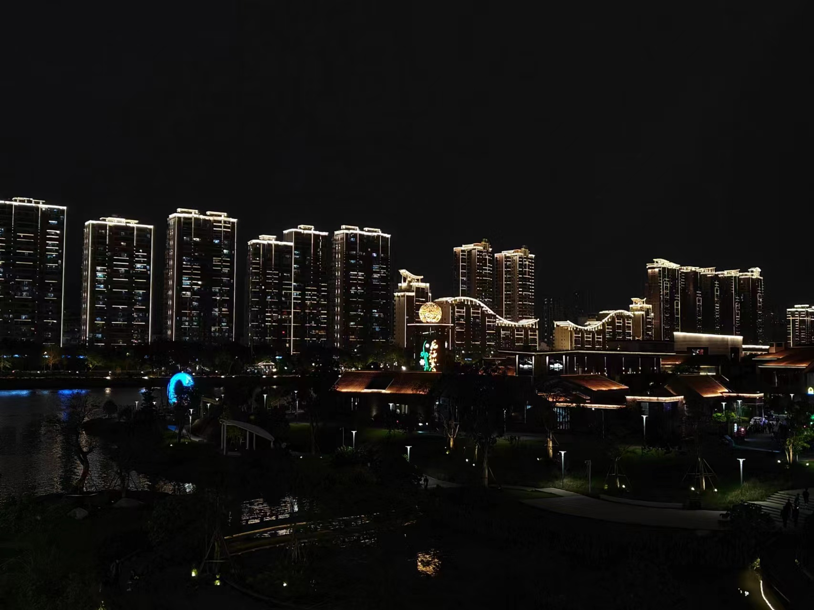
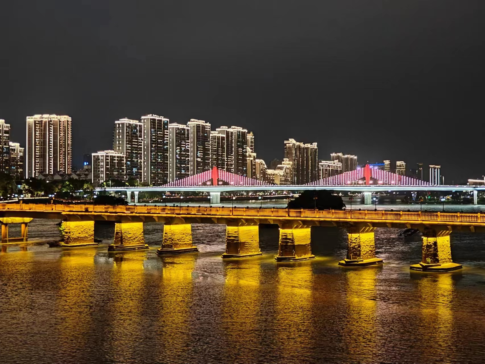
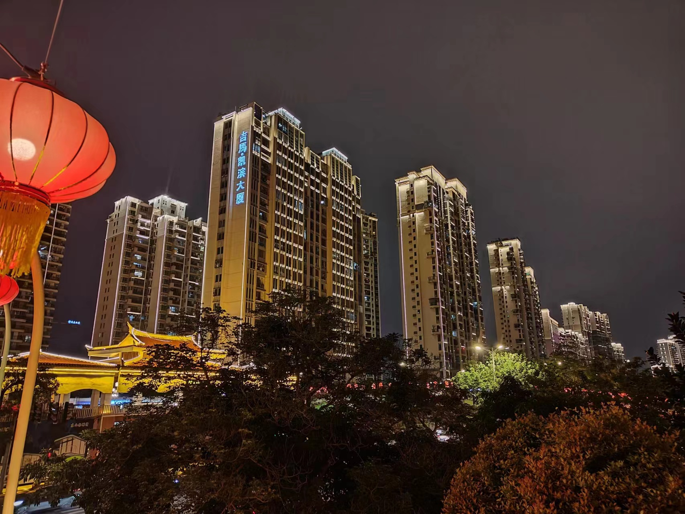
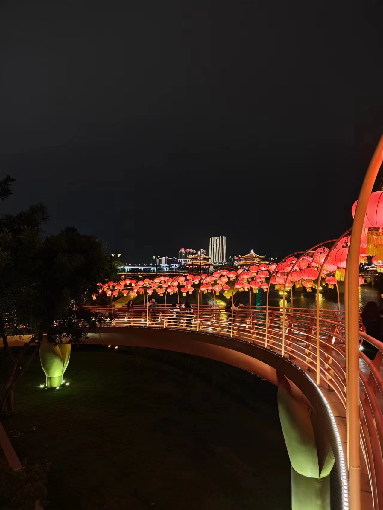
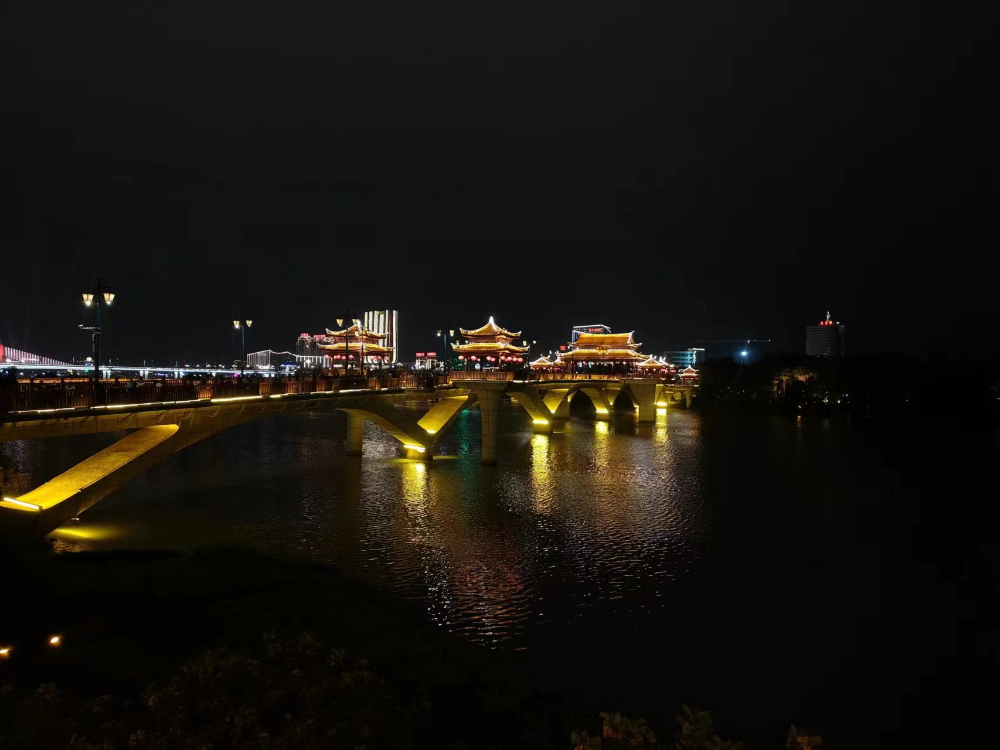
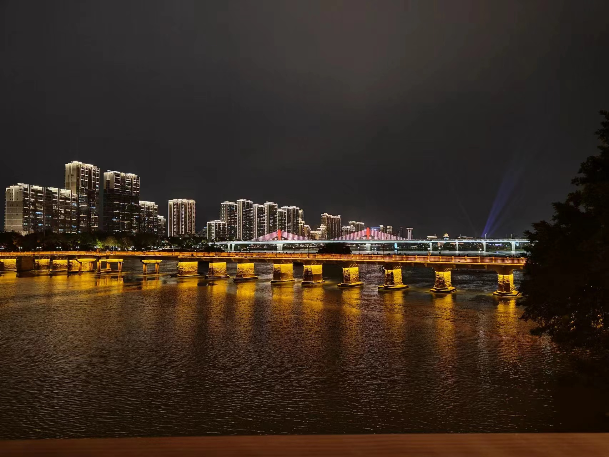
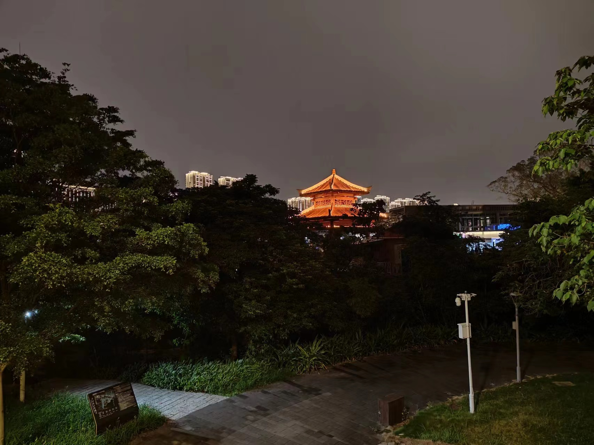
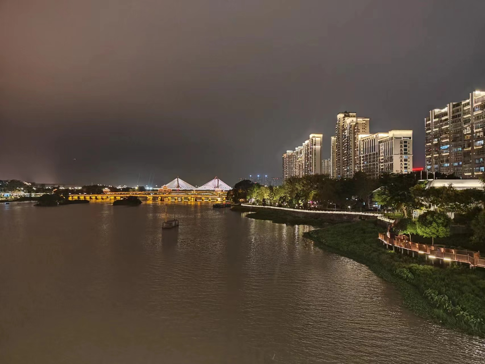

# 漳州游记: 漳州城的夜景

漳州的夜很美，一般而言，那些由灯光营造的、人造的景色，似乎天生带有一种工业气息，给人一种虚幻的不真实感，可没有人规定梦不可以是美的，若是这种灯光的色调、明暗经过精心的调制，则可让身临其境的人有一种如梦似幻的感觉，现代的霓虹，具有一种独特的美感，这种美感跟自然界的清风碧绿拂过脸颊映入眼帘不同，声光电色营造的光景是自然界所不具有的、代表人们意志的科技美感。

我想这是旅游业大肆发展的好处，旅游业是一个很好的产业，带动了经济的发展，也很好的满足了人们心中对于远方的畅想，是一个很良性的产业，而且我感觉这个产业对于技术依赖较小，各个城市都可以蓬勃发展，毕竟每个城市都有其独特的自然风光、文化和迷人之处，而丰富生命意义的方式之一就是尽可能的感受更多的体验。

另外，我觉得旅游业促进了资源的平均分配，那些在大城市努力赚钱的人，节假日则一窝蜂的涌向那些旅游城市消费，这样一来就给当地的居民带来了财富。

话不多说，直接上图：

感觉活在这里是真的惬意，这里的节奏不太快，也不太慢，夜晚很舒服，隔壁就是古城小吃街，吃住都很舒服，查了下，上图河边的商品房，均价是2.23w，说实话，对于一个三线城市来说，是不是还是有点贵了……大部分当地居民的收入应该还是买不起，我想只有那种类似于隔壁繁华的小吃街有店铺的当地居民，才能享受旅游产业带来的红利，才能买得起这样的房子。

对于游客而言还是欣赏一下就可以了，融入这里还是不太现实。

