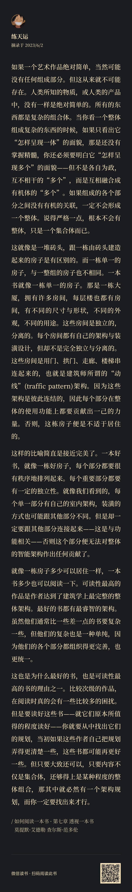
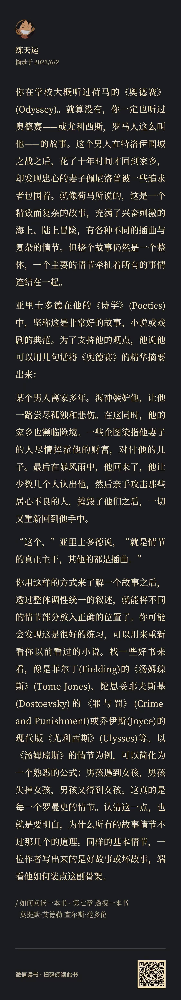

# 日报：儿童节快乐

## 闲言碎语

* 儿童节快乐！

* 有个小仙女网友，之前主动在群里帮我分享了公众号，今天，她又帮我在朋友圈分享了公众号（虽然挑了一篇我为数不多的非原创的吴军老师的文章），what a nicely girl！蟹蟹你~！

* 欢迎新关注的盆友~不知不觉粉丝量都快破百了！感觉得迫在眉睫的写一篇关于本公众号的介绍了~

* 当我根据内容自然而然的把在写的这份东西取名为“日报”的时候，我突然明白了为什么工作中会有日报周报月报这个东西，如果你能像我现在的心态和态度去面对我现在在写的这份东西的话，你是真的会有进步（这里感觉可以单独写篇文章了）！

## 日行一步

* 读完了书籍《如何阅读一本书》的《一本书的分类》一章、在读《透视一本书》

* 看完了useRequest的轮询插件的源码，对应输出：【ahooks源码解读】轮询插件的实现

## 分享

① 在阅读理解中，常常要求你去找出一本书的结构和脉络。

可是，我们并未接受过所谓的“书籍教育”这样的东西，也很少可以站在作者的角度，去思考一本书的构成。

所以，我们往往对于“书”这个概念的相关知识理解并不清晰。

但实际上，“书”作为人类作品，跟人类其它的艺术作品一样，有它的一些基本创作规则、评判标准，今天，我就看到了一个使用比喻对“书”这个概念进行讲解的精妙绝伦的比喻：

② 一直以来，我常常会觉得那些文学小说看完就只是看了个故事，对于“主线”、“支线”这样的概念感知相当模糊。

更不要提，自己创作一个故事了，可是接下来看到的内容，却让我一下子对于“故事”这个概念的认知，我想也提高了我阅读小说的能力，因为以后我必然就会带着这样的思维去阅读小说了。

我一下子想起了高中时期曾经看过的《霍乱时期的爱情》这本书，并自然而然的用这个方法说出了它的故事：

一个男人年轻的时候爱上一个女人，但是命运使然，无法在一起，在这之后的多年，男人与各种各样的女人有过肉体上的经历，这些女人与男主的情感形态也许代表着人间各式各样的爱情形态，但男主精神上却始终只爱着一开始那个女人，等到老年以后，女人丈夫死去，霍乱肆虐的背景，他们终于走到了一起。

当这样简明扼要的概括故事情节后，我又自然而然感觉到，马尔克斯既然安排这样的结局，想必对这种“只有精神上纯粹的爱情”，还是持肯定和积极的态度吧。

或许他认为，纯粹的爱情也许本身就仅仅是精神上的，他刻意安排了“性”与“爱”的分离的情节，来表明爱情的纯粹。

可是在两个老人在一起后，他又把“性”作为情节融入了进去，我想也许又从态度上表明了“由爱及性”的自然交融与不可分割、浑然一体吧。

