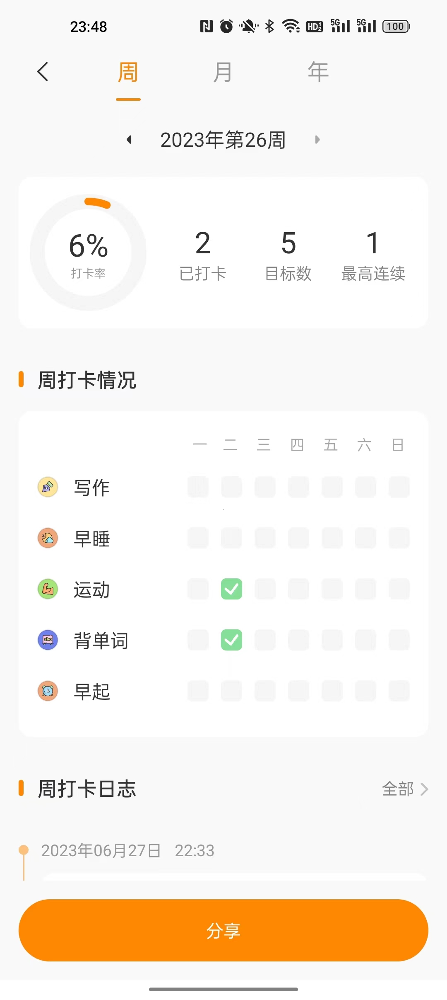

# 06/27 两个产品推荐、生财有术社区

### flomo

前几天，我写了一篇《一个产品的想法》，提到需要一个把你记录的内容推送你的功能。

更久之前，我写过一篇《闪念》，提到需要一个非常便捷即可快速记录想法的产品。

我今天发现这两个需求被一个产品同时满足了，实在优秀，它的名字叫做：**flomo，中文名浮墨笔记**。

它提供web、pc、安卓、ios版全平台覆盖，同时支持微信发送到公众号快速记录的功能，同时，pro会员支持想法回顾，即我在《一个产品的想法》里提到的想法推送功能。

推荐给大家。

### 指尖时光

第二条依旧是一个应用推荐，之前，我曾经推荐过微软的Todo应用。

今天，我发现一个同样做的很优秀的国产应用，使用体验上，似乎比Todo还要好一些。

使用国内软件和国外软件有一个能很明显感受到的差异，就是设计上“繁”与“简”的差异。

你很难片面的去说哪个好，功能更加全面的应用，自然能满足的需求也多一点。

但专注于核心功能的应用，则会非常趁手，而且学习成本很低，同时，界面会非常的好看。

不管，怎么样，都推荐一下，你们自己选择吧~

它长这样：

### 生财有术

我参加了生财有术星球的三天体验营活动，可以免费观看星球半年内的内容。

要加入这个星球，付费门槛高达2500元/年。

这是一个教人“赚钱”的星球。

对我，他倒也没什么广告，我就是自己在看他提供的内容。

看了一些之后，说实话，还是有点动心。

虽然我也上网查了一些，说什么的都有，有说割韭菜的，也有说好的。

但我现在有一个比较好的优点在于，我会保持着一种对于“理性”的尊重。

也就是说，我还是比较能坚定自己的判断了，我不再被别人的“情绪”所感染，而凭借他人说服我的言语逻辑进行判断。

虽然很贵，但是我平时基本不怎么花钱，花在这种投资自己的地方上似乎也是值得的，而且我执行力还可以，应该不至于进去看看就出来了。

我还是蛮想参加所谓的“航海”（项目实战）的。

希望自己尽快赚到钱吧。

