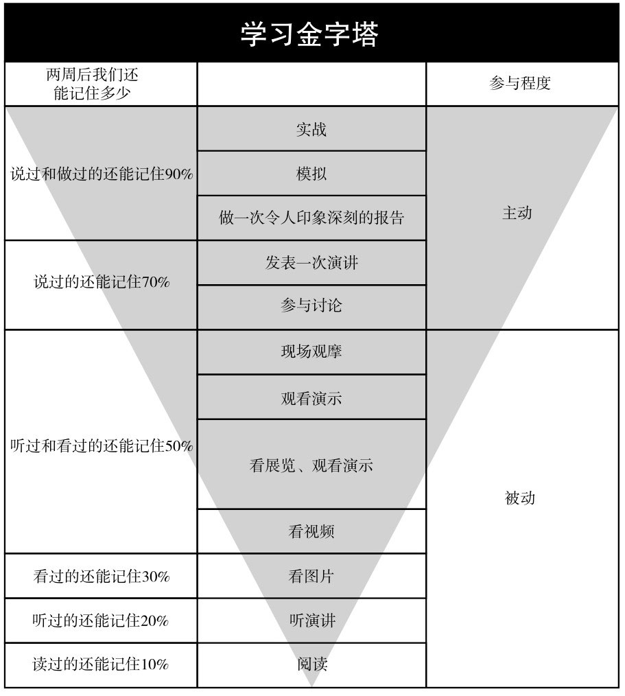

# 07/24 你为我骄傲，我却未曾因你感到自豪

昨天想着姑姑从老家出来这段时间，我因为工作原因，基本没怎么招待，下周姑姑又要回去了，就想着带姑姑去外面吃顿饭，就去吃了顿牛蛙。

结果我今天一天发烧、头痛，喉咙痛。

近来不知为何，阅读的欲望减弱了，兴许是书架上已经有了太多的书，已经没有找新书看的欲望了。

随手翻看，便又看起了《穷爸爸富爸爸》。

阅读有一个很奇妙的现象，当你心中所想某件事的时候，书似乎奇妙的懂你心中所想，会把你在犹豫的观点送到你面前。

比如，正当我觉得阅读欲降低的原因是觉得通过阅读学习也低效的时候，书中就给了这样一个观点。

从这个图看，阅读还真是学习效率最低的方式。

短视频真的毁了我，到现在，我还长长不知不觉会在B站刷起短视频，所以，我决定卸载掉它。

其实B站是一个很好的长视频网站，如今却发展成了这个样子，这既是无奈，也是悲凉。

所幸，我平时刷的内容有些还是有益，因此有时倒也让我能有一些收获。就如刚刚，我再一次刷到了李健的文章，不知为何，读罢又让我颇有一种热爱上文字、感受到文字背后的温度的感觉，他的文字很温柔、很真诚，和他本人给人的感觉一模一样，见字如面、确实是这样。

下面分享以下他的这篇文章，是写给他的父亲的：

**你为我骄傲，我却未曾因你感到自豪**

有一封信现在看来很有意思，当时我在大学经常演出，也写歌作曲，母亲担心这样会影响学业，信里写道：“你现在还是应该以学业为重，不要老想着当歌星之类的，那些都是梦，不现实。咱家人都是老百姓，你要学一门技术，毕业找个好工作，要做一个对国家有用的人才，父母不指望你能出名挣钱。”其实那时我就是热爱音乐而已，在校园里比较活跃，也没有想过把音乐当作一个职业，因为就像我母亲说的那样，这样的职业离我们这样的家庭太遥远了，我不可能成为经常在电视里出现的人。她也深知，靠唱歌为生有多难，因为我的父亲就是名京剧演员，她看到了从事艺术工作所付出的代价。

小的时候，我一直跟随父亲上班，他们排戏的时候我就在京剧团的院子里四处闲逛，陪伴我的是花花草草和蝴蝶蜻蜓，以及大把的时间。每当父亲找我时，总会有人告诉他，刚刚还看见李健手里拿着馒头奔跑呢——不知为何，当时的我手里总拿着馒头，可能那个年代馒头也是孩子们的零食吧。

父亲是我见过的最老实善良的人，用当今的话说，就是完全无公害。记忆里，关于他最初的印象是在一个初冬季节，我猜当时我也就三岁左右。我记得我站在床上，父亲边给我穿棉裤边说：“下雪了，冬天来了。”我至今还记得自己看着窗外鹅毛大雪从天而降的情景，那也是我对雪的第一次记忆。但这次记忆中，完全没有关于寒冷的感受。

几年后的一个寒冬（其实哈尔滨的冬天都是寒冬），我常常在夜半醒来，发现父亲在写东西（平时他经常读报纸，但基本不写什么），有时还捂着胸口。我感到很奇怪。原来单位给许多演员都涨了工资，却没有父亲，据说是一个给领导送礼的人占了本属于父亲的名额，父亲在给上级部门写信投诉。由于心情不好，他的胃病犯了。我想，父亲在乎的不仅仅是几级工资的钱，还有一个演员对于职称的认可和艺术的尊重。那是我第一次感到他的忧郁，至今还能记得他的表情。

这件事后来结果怎么样我已经不记得了，他的忧郁何时消散的也忘记了。普通人的家庭就像漂浮在海上的小船，随时来的风雨都可以让它摇摇晃晃，而对于我来讲，更多感受的是小船里的温馨。

初中毕业的时候我考上了市里面最好的高中，相当于中学里的清华。有一次父亲要随单位去俄罗斯演出，当天母亲让我去火车站送父亲，我感到有些意外。以前他出差时都是自己去车站，因为平时父亲的话不多，也从来不麻烦我为他做任何事情，后来才知道，父亲是想在同事面前小小地炫耀一下他的儿子。因为小时候那些叔叔阿姨都很喜欢我，如今多年不见，又考上了最好的高中，父亲特别想让他们见见我。我还记得当时他们夸奖我时，父亲流露出的满足的表情，那时我真正意识到他为我感到骄傲。而我也同时发现他有些老了，和从前的那个神采飞扬的武生父亲略有差别了。我的心隐隐地收紧了一下。

记忆中我的父亲在我面前只流过两次眼泪，一次是有一年从北京放假回家时，我跟父亲说我给爷爷带了一件礼物，他告诉我爷爷去世了，我看到他流下了眼泪。还有一次是他得了癌症之后，要做手术，我和姐姐凑齐了钱去交费时，他感动得哭了，他说孩子们懂事了，给孩子们添麻烦了。这让本已焦虑的我心如刀割。

我把当时仅有的几万块钱全拿出来了，我意识到，有些时侯钱是多么重要。随后他的病情每况愈下，生命的最后阶段，我送他回哈尔滨。火车上，他已经很虚弱了，每次去洗手间都要我搀扶或者背着他，我一宿没怎么睡觉。记得当我背着他时，他说了句，原谅爸爸。那一瞬间，我强忍住了泪水。他太客气了，竟然对自己从小背到大的儿子客气，而我只是背了他几次而已。

父亲的后背曾是我最熟悉的地方，是童年的我常常在此睡觉的温暖天堂。我尽管看不到他的表情，可我知道那是我熟悉的表情，我深知这句简单的话里的含义，有内疚、有感激、有牵挂，更有不舍……当时我的歌唱事业没有什么大的起色，他一直担心我的生活。多年以后，我偶尔会想起这个场景，想起这句话，常常不能释然，就像落笔的此刻，我的眼泪又夺眶而出。

我曾经写过一首歌叫《父亲》，里面写道: 你为我骄傲，我却未曾因你感到自豪，你如此宽厚，是我永远的惭愧。去年我重新录制了这首歌，在最后加了一句：我终于明白在你离去的多年以后，我为你骄傲，当谈起你的时候……我知道了，我为他感到骄傲的，是他对生活的隐忍和对家庭的忠诚。

如今，我们三个孩子都生活北京，母亲如候鸟般往返于哈尔滨、北京和海南。她在孤独中寻找快乐，寻找能让她过下去的生活。人生终究是残酷的，母亲步入这样的年华后开始面临着更多的意外的告别，她的父母和兄弟姐妹中也陆续发生着生离死别，有时想想我真为她担心。

现在，每当我取得什么成绩时，她在高兴之余常常会说，要是你爸还活着该有多好。前些天，她在看我的电视节目，当我唱完一首歌，她一个人对着电视机激动得鼓起了掌，还连声喊道：好好好！她把这些当作有趣的事情告诉了我，听后我也乐了，可随后心里却涌出一丝悲凉。是啊，要是父亲还活着该有多好，那鼓掌的就不是她一个人了，他们俩一定会热烈地讨论，我甚至可以想象他们谈话的内容。

只是，我想象不出父亲如果活到现在时的面容，在我的记忆里，他最后定格的样子远远年轻于现在的母亲了。

