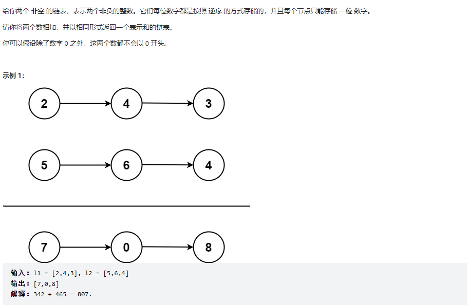
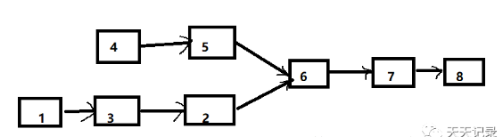

# 链表面试高频题及相应代码参考

链表几乎是面试必问，大部分情况都是要求白板编程（手写代码），为什么？首先链表相关题目往往代码量很小，难度却相对较大，非常适合作为面试题。其次，链表是最简单的带有天然递归结构的数据结构，往往考察链表就能考察出一个人的递归代码编写能力。

下面是我整理的几个面试中高概率出现的题目以及相应的参考代码（python实现）。

先给出结点的定义：
~~~python
class ListNode:
    def __init__(self,val):
        self.val = val
        self.next = None
​
    #将列表打印为5->4->3->None这样的形式
    def __str__(self):
        cur = self
        res = ''
        while cur:
            res += (str(cur.val)+'-->')
            cur = cur.next
        res += 'None'
        return res
        
    #返回链表长度
    def get_len(self):
        cur = self
        res = 0
        while cur:
            res += 1
            cur = cur.next
        return res
~~~
## 大名鼎鼎的反转链表
题目描述：给定一个链表，返回反转后的链表的头结点。
这个问题已经普遍到几乎成为面试的标配题目了。
先给递归形式的实现：
~~~python
#该递归函数的宏观语义：给定一个链表，返回反转后的链表的头结点
def reverselist(head):   
    if not head or head.next is None:
        return head
    '''
    该判断条件中，左部分用于处理边界条件，如果传进来的链表为None，直接返回，
    右部分用于处理递归出口，若该节点的下一个节点为None，表明已经到了尾节点，
    也是直接返回head
    '''    
    res = reverselist(head.next)
    '''    
    将以该节点的下一个节点为头结点的链表反转后返回头结点    
    比如说1->2->3->4，调用该语句后得到的链表为:
    1->2<-3<-4
    ^        ^
    |        |
    head     res
    '''
    head.next.next = head
    #这时候只要让2指向1就可以了
    head.next = None
    #让1指向None
    return res
~~~
这个递归过程不太好理解，所以我写了比较详细的解释。但即便如此，也仍然没有给出递归具体的执行细节、一步步是如何类似于回溯一样得到最终结果的，递归本身是一个非常不好理解的编程方法，往往借助动画演示比较有助于理解，但对于理解他人的递归代码有困难的情况，一个切入点是，时刻牢记这个递归函数的宏观语义，比如说以上的例子，当你尝试去理解reverseliste(head.next)这句代码的时候，只要记住我传入的节点是什么，会得到的结果是什么，得到结果以后如何处理这个结果，这样，即使不理解结果的回溯过程，也是可以读懂递归代码的。

下面给非递归的写法：
无论是对于递归还是非递归，对于链表类问题代码的理解，有一个通用的技巧，那就是借助纸笔，暂时理解不了的代码可以先不管，按着它的意思执行一遍再说，用纸笔手动写出那些节点的指向是怎么变动的(像我写的注释那样)，很多时候走了几步观察一下结果自然就懂了。

给出了方法论，那么下面的代码就不一一解释了，可以自己理解一下代码，有疑惑的地方可以提出一起交流。
~~~python
def reverseList(head):
    pre = None
    cur = head
    while cur:
        next = cur.next
        cur.next = pre
        pre = cur
        cur = next
    return pre
~~~
## 删除链表中所有重复的元素，返回头结点
递归写法：
~~~python
def delete_Equal(head,val):
    #递归出口
    if not head.next:
        if head.val == val:
            return None
        else:
            return head
    #处理头结点        
    if head.val == val:
        if head.next:
            return delete_If(head.next,val)
        else:
            return None
    else:
        head.next = delete_If(head.next,val)
        return head
~~~
循环写法：
~~~python
def delete_equal(head,val):
    dummyhead=ListNode(0)
    dummyhead.next=head
    pre=dummyhead
    cur=head
    while cur:
        if cur.val==val:
            next=cur.next
            pre.next=cur.next
            cur.next=None
            cur=next
        else:
            pre=pre.next
            cur=cur.next
    return dummyhead.next
~~~
## 合并两个有序链表成一个新的有序链表
循环写法（类似归并排序的合并过程）
~~~python
def merge_two_list(list1,list2):
    re = ListNode(0)
    res = re
    while list1 and list2:
        if list1.val > list2.val:
            res.next = list2
            res = res.next
            list2 = list2.next
        else:
            res.next = list1
            res = res.next
            list1 = list1.next
    if not list1:
        res.next = list2
    if not list2:
        res.next = list1
    return re.next
~~~
递归写法:
~~~python
def merge_two_List(l1,l2):
    if not l1:
        return l2
    if not l2:
        return l1
    if l1.val < l2.val:
        l1.next = merge_two_List(l1.next,l2)
        return l1
    else:
        l2.next = merge_two_List(l1,l2.next)
        return l2
~~~
上面三个问题，就是比较常见的链表操作的题目，准确的说是常考的里面难度比较低的，但即便是这样，就我看过的面经来说，即便是大厂也常常会重复考这几个问题，但也有一定概率会碰到较难的一类链表问题，这类问题往往要组合运用上面的方法才能解出来。比如说下面这题：

## 组合题目
Given a singly linked list L: L 0→L 1→…→L n-1→L n,
reorder it to: L 0→L n →L 1→L n-1→L 2→L n-2→…
You must do this in-place without altering the nodes' values.
For example,
Given{1,2,3,4}, reorder it to{1,4,2,3}.

原题目就是英文，比较简单应该都看得懂。
上面这题的解题思路为：
1.找到中间结点
2.将中间结点后的链表反转（运用链表反转的算法）
3.将得到的两个链表合并（合并规则是各依次取一个，跟上面规则不同，但本质仍然是链表合并）

还有下面这题：
## 链表反转1->2->3->4 变 2->1->4->3

乍一看会觉得规则很奇怪，但抽象一下可以理解为，先分别拆分出奇数位和偶数位的元素，再依次取出一个合并（先取偶数位）。
有没有发现，链表的拆分和合并就像是解决这类复杂变形问题的工具一样，灵活运用可以解决各类链表变形问题。

下面再给出两个相对上面来说难一点的链表类常考题:
## leetcode-2

这题的难点就在于两个链表的长度可能不相等，不做特殊处理直接加的话最后会有大量边界条件的判断（谁先为空谁后为空等等），我第一次就用了大量if...else写了七十多行出来，后来我看到一个非常聪明的做法....那就是，补0让它们对齐，当然，你不用真的去给它添加结点，只要判断到一条链表对应位置是否已经没有元素了，没有就通过选择语句取0就可以。
直接上代码：
~~~python
def add_two_number(l1,l2):
    res = ListNode(0)
    re = res
    remainder = 0
    while l1 or l2:
        l1_val = l1.val if l1 else 0
        l2_val = l2.val if l2 else 0
        temp = (l1_val + l2_val + remainder) % 10
        re.next = ListNode(temp)
        remainder = (l1_val + l2_val + remainder) // 10
        re = re.next
        if l1:
            l1 = l1.next
        if l2:
            l2 = l2.next
    if remainder:
        re.next = ListNode(1)
    return res.next
~~~
70多行代码只剩下18行了

## 求两个单链表的第一个公共结点。
(变种:求两个单链表的公共片段的长度，头条真题)，要求在O(n)的时间复杂度和O(1)的空间复杂度内完成。

算法的时间复杂度要求一般来说增加了解题的难度，但也不单纯是这样，复杂度的要求其实对于解题具有一定的提示作用。

算法要求O(1)的空间复杂度，就意味着不能借助于其他任何数据结构，也就是说解这题需要纯靠遍历和借助几个临时的变量来求解。而O(n)的时间复杂度要求，就意味着只能存在一层循环（不能嵌套循环，但一层的循环运行任意常数次，复杂度不变），实际上，理解到这里已经有相当多的信息了。

下面理解一下题目，公共结点是什么意思呢？就是说，这两条链表中两个节点，指向的是同一个结点（对象）(并不是两条链表中都有一个值等于多少的结点，而是真正的指向了同一个结点)，这意味着什么呢？这意味着从这个结点开始这两条链表后半部分是完全相同的!(从一个结点开始只能延伸出一条链表)，像这样

这样，结合刚刚分析出来的解题思路，可以给出这样一个方案:
先两条链表都遍历一遍，分别统计出长度，计算出长度差，接着再次遍历，让长的先走”长度差”个步数，然后同时开始走，遇到的第一个相同的就是第一个公共节点(记录这个步数)，判断条件不是值相等，而是对象相等，这时候，不论是解答这个问题还是变种问题，都已经得到了答案。
~~~python
def common_node(l1,l2):
    #get_len方法在结点的内部实现
    len_l1,len_l2 = l1.get_len(),l2.get_len()
    long_list = l1
    short_list = l2
    differ = len_l1 - len_l2
    if len_l2 > len_l1:
        long_list = l2
        short_list = l1
        differ = -differ
    while differ:
        long_list = long_list.next
        differ -= 1
    while long_list and short_list and long_list is not short_list:
        long_list = long_list.next
        short_list = short_list.next
    return long_list
~~~
一般来说，这类代码量小的题目对于思维能力的要求都比较高，考察的是一个人的编程思维和代码编写（尤其是递归代码）的综合能力，但实话说不知道是出于懒还是认为这个难度已经够的原因，大部分公司都是直接用现成的题目来考的，因此，不论是冲着碰运气看看能不能碰到现成题还是锻炼编程能力的角度看，上面几个题我认为都是非常有必要自己编程实现和掌握的（除第4.5题不具有典型性，其他5个都非常高频，67相对较难）。