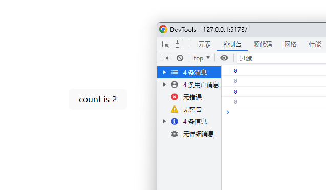

# useMemorizedFn

作用：持久化 function 的 Hook，理论上，可以使用 useMemoizedFn 完全代替 useCallback。

在某些场景中，我们需要使用 useCallback 来记住一个函数，但是在第二个参数 deps 变化时，会重新生成函数，导致函数地址变化。

```
const [state, setState] = useState('');

// 在 state 变化时，func 地址会变化
const func = useCallback(() => {
  console.log(state);
}, [state]);
```
使用 useMemoizedFn，可以省略第二个参数 deps，同时保证函数地址永远不会变化。
```
const [state, setState] = useState('');

// func 地址永远不会变化
const func = useMemoizedFn(() => {
  console.log(state);
});
```
源码：
```
function useMemoizedFn<T extends noop>(fn: T) {
  const fnRef = useRef<T>(fn);

  // why not write `fnRef.current = fn`?
  // https://github.com/alibaba/hooks/issues/728
  fnRef.current = useMemo(() => fn, [fn]);

  const memoizedFn = useRef<PickFunction<T>>();
  if (!memoizedFn.current) {
    memoizedFn.current = function (this, ...args) {
      return fnRef.current.apply(this, args);
    };
  }

  return memoizedFn.current as T;
}
```
这个源码非常简单，无非就是利用进行了`if (!memoizedFn.current)`的判断结合内部对`memoizedFn.current`的赋值，实现多次调用这个hooks时只会对`memoizedFn.current`赋值一次，而赋值对象是一个在赋值时才定义的函数，因为只赋值了一次，所以只定义了一次，地址就永远保存在`memoizedFn.current`了，接着返回这个`memoizedFn.current`，就实现了不论调用多少次始终只返回唯一地址的效果。

而当调用这个函数时，因为这个函数定义时候就用闭包的原理维持了对`fnRef.current`的引用，而每次调用该hooks时`fnRef.current`又会保存最新传进来的这个函数的引用，所以可以实现每次调用时调用到传入的函数的效果。

需要注意的是，这个函数能否访问到最新的state其实取决于你传入的函数是否能访问到最新的state，如果传入的函数是被useCallback缓存过的或因为某种原因形成了闭包而无法访问到最新的state，useMemorizedFn并不会改变这一点，useMemorizedFn能保证的，仅仅是返回的函数地址不变。

具体可以看下以下的代码：
```
function App() {
  const [count, setCount] = useState(0)

  const logCount = useCallback(() => {
    console.log(count);
  }, [])

  const memeizedFn = useMemoizedFn(logCount)

  memeizedFn()

  return (
    <button onClick={() => setCount((count) => count + 1)}>
      count is {count}
    </button>
  )
}
```
可以看到，count无论如何增加，该函数被多次调用后log的值仍然是0。
