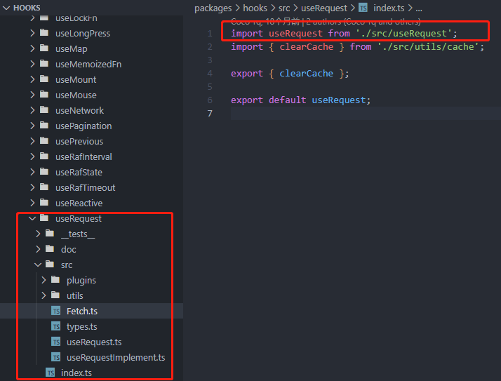

# useRequest - 基础用法

useRequest是ahooks里面最核心的一个hooks，也是使用最高频、功能最丰富、最为复杂的一个hooks。

官方对其的介绍为：

`useRequest` 是一个强大的异步数据管理的 Hooks，React 项目中的网络请求场景使用 `useRequest` 就够了。

`useRequest` 通过插件式组织代码，核心代码极其简单，并且可以很方便的扩展出更高级的功能。目前已有能力包括：

- 自动请求/手动请求
- 轮询
- 防抖
- 节流
- 屏幕聚焦重新请求
- 错误重试
- loading delay
- SWR(stale-while-revalidate)
- 缓存

注意这句话：`useRequest` 通过插件式组织代码，核心代码极其简单，并且可以很方便的扩展出更高级的功能。

也就是说，虽然`useRequest`功能很丰富，但是核心代码很简单，而很多丰富的功能是通过插件来实现的，在这之前我还没有学习过插件的实现机制，今天正好来学习一下，首先我们来看下`useRequest`的核心代码。

先看看`useRequest`这个hooks的项目结构：



入口文件在useRequest.ts,我们看下它内部的核心代码：

```js
function useRequest<TData, TParams extends any[]>(
  service: Service<TData, TParams>,
  options?: Options<TData, TParams>,
  plugins?: Plugin<TData, TParams>[],
) {
  return useRequestImplement<TData, TParams>(service, options, [
    ...(plugins || []),
    useDebouncePlugin,
    useLoadingDelayPlugin,
    usePollingPlugin,
    useRefreshOnWindowFocusPlugin,
    useThrottlePlugin,
    useAutoRunPlugin,
    useCachePlugin,
    useRetryPlugin,
  ] as Plugin<TData, TParams>[]);
}

export default useRequest;
```
入口文件的代码很简单，用户在使用useRequest时，会传入三个参数，其中，第一个参数是一个异步函数，第二个参数是Options，第三个参数则是一个plugins列表，这里直接调用useRequestImplement并将参数透传进去，同时，第三个参数里合并了ahooks内部已经实现的plugins，因此，我们可以推测useRequestImplement内部是实现了插件的注册的。

我们看下useRequestImplement的代码:

```js
function useRequestImplement<TData, TParams extends any[]>(
  service: Service<TData, TParams>,
  options: Options<TData, TParams> = {},
  plugins: Plugin<TData, TParams>[] = [],
) {
  const { manual = false, ...rest } = options;
  // 1. 用户传入的options构造fetchOptions
  const fetchOptions = {
    manual,
    ...rest,
  };
  // 2. 使用ref保存成传入的异步函数
  const serviceRef = useLatest(service);
  // 2. 得到一个使组件重新渲染的update方法
  const update = useUpdate();
  // 3. 在首次调用该组件时，用new Fetch构建一个fetch实例
  const fetchInstance = useCreation(() => {
    const initState = plugins.map((p) => p?.onInit?.(fetchOptions)).filter(Boolean);

    return new Fetch<TData, TParams>(
      serviceRef,
      fetchOptions,
      update,
      Object.assign({}, ...initState),
    );
  }, []);
  // 4. 用户传入的options保存在fetchInstance的options选项上
  fetchInstance.options = fetchOptions;
  // run all plugins hooks
  // 5. 依次调用hooks，将fetch实例和options作为传入传入，并赋值到pluginImpls属性上，我们可以猜测，正是在这一步完成了插件的注册
  fetchInstance.pluginImpls = plugins.map((p) => p(fetchInstance, fetchOptions));
  // 6. 如果options中manual不为true，首次渲染完成后自动执行fetchInstance的run方法
  useMount(() => {
    if (!manual) {
      // useCachePlugin can set fetchInstance.state.params from cache when init
      const params = fetchInstance.state.params || options.defaultParams || [];
      // @ts-ignore
      fetchInstance.run(...params);
    }
  });
  // 7. 组件卸载时可能有请求正在进行，调用一下cancel方法取消请求。 
  useUnmount(() => {
    fetchInstance.cancel();
  });
  // 8. 返回对外暴露的api。
  return {
    loading: fetchInstance.state.loading,
    data: fetchInstance.state.data,
    error: fetchInstance.state.error,
    params: fetchInstance.state.params || [],
    cancel: useMemoizedFn(fetchInstance.cancel.bind(fetchInstance)),
    refresh: useMemoizedFn(fetchInstance.refresh.bind(fetchInstance)),
    refreshAsync: useMemoizedFn(fetchInstance.refreshAsync.bind(fetchInstance)),
    run: useMemoizedFn(fetchInstance.run.bind(fetchInstance)),
    runAsync: useMemoizedFn(fetchInstance.runAsync.bind(fetchInstance)),
    mutate: useMemoizedFn(fetchInstance.mutate.bind(fetchInstance)),
  } as Result<TData, TParams>;
}

export default useRequestImplement;

```
代码里，分别用注释表明了对应的代码在干什么。

我们在集中提取出来看看，会更加明显的看到代码的逻辑顺序：

1. 用户传入的options构造fetchOptions
2. 使用ref保存成传入的异步函数
3. 在首次调用该组件时，用new Fetch构建一个fetch实例
4. 将fetchOptions保存在fetchInstance的options属性上
5. 依次调用hooks，将fetch实例和options作为传入传入，并赋值到pluginImpls属性上，我们可以猜测，正是在这一步完成了插件的注册
6. 如果options中manual不为true，首次渲染完成后自动执行fetchInstance的run方法
7. 组件卸载时可能有请求正在进行，调用一下cancel方法取消请求。
8. 返回对外暴露的api。

所以useRequestImplement这个函数内的代码大概就是做了这几件事，我们可以看出，这里的核心逻辑是new Fetch得到fetch实例，因此要进一步探究，则要看Fetch的内部的实现。

其中核心代码如下：
```js
import { isFunction } from '../../utils';
import type { MutableRefObject } from 'react';
import type { FetchState, Options, PluginReturn, Service, Subscribe } from './types';

export default class Fetch<TData, TParams extends any[]> {
  pluginImpls: PluginReturn<TData, TParams>[];

  count: number = 0;

  state: FetchState<TData, TParams> = {
    loading: false,
    params: undefined,
    data: undefined,
    error: undefined,
  };

  constructor(
    public serviceRef: MutableRefObject<Service<TData, TParams>>,
    public options: Options<TData, TParams>,
    public subscribe: Subscribe,
    public initState: Partial<FetchState<TData, TParams>> = {},
  ) {
    this.state = {
      ...this.state,
      loading: !options.manual,
      ...initState,
    };
  }

  setState(s: Partial<FetchState<TData, TParams>> = {}) {
    this.state = {
      ...this.state,
      ...s,
    };
    this.subscribe();
  }

  runPluginHandler(event: keyof PluginReturn<TData, TParams>, ...rest: any[]) {
    // @ts-ignore
    const r = this.pluginImpls.map((i) => i[event]?.(...rest)).filter(Boolean);
    return Object.assign({}, ...r);
  }

  async runAsync(...params: TParams): Promise<TData> {
    this.count += 1;
    const currentCount = this.count;

    const {
      stopNow = false,
      returnNow = false,
      ...state
    } = this.runPluginHandler('onBefore', params);

    // stop request
    if (stopNow) {
      return new Promise(() => {});
    }

    this.setState({
      loading: true,
      params,
      ...state,
    });

    // return now
    if (returnNow) {
      return Promise.resolve(state.data);
    }

    this.options.onBefore?.(params);

    try {
      // replace service
      let { servicePromise } = this.runPluginHandler('onRequest', this.serviceRef.current, params);

      if (!servicePromise) {
        servicePromise = this.serviceRef.current(...params);
      }

      const res = await servicePromise;

      if (currentCount !== this.count) {
        // prevent run.then when request is canceled
        return new Promise(() => {});
      }

      // const formattedResult = this.options.formatResultRef.current ? this.options.formatResultRef.current(res) : res;

      this.setState({
        data: res,
        error: undefined,
        loading: false,
      });

      this.options.onSuccess?.(res, params);
      this.runPluginHandler('onSuccess', res, params);

      this.options.onFinally?.(params, res, undefined);

      if (currentCount === this.count) {
        this.runPluginHandler('onFinally', params, res, undefined);
      }

      return res;
    } catch (error) {
      if (currentCount !== this.count) {
        // prevent run.then when request is canceled
        return new Promise(() => {});
      }

      this.setState({
        error,
        loading: false,
      });

      this.options.onError?.(error, params);
      this.runPluginHandler('onError', error, params);

      this.options.onFinally?.(params, undefined, error);

      if (currentCount === this.count) {
        this.runPluginHandler('onFinally', params, undefined, error);
      }

      throw error;
    }
  }

  run(...params: TParams) {
    this.runAsync(...params).catch((error) => {
      if (!this.options.onError) {
        console.error(error);
      }
    });
  }

  cancel() {
    this.count += 1;
    this.setState({
      loading: false,
    });

    this.runPluginHandler('onCancel');
  }

  refresh() {
    // @ts-ignore
    this.run(...(this.state.params || []));
  }

  refreshAsync() {
    // @ts-ignore
    return this.runAsync(...(this.state.params || []));
  }

  mutate(data?: TData | ((oldData?: TData) => TData | undefined)) {
    let targetData: TData | undefined;
    if (isFunction(data)) {
      // @ts-ignore
      targetData = data(this.state.data);
    } else {
      targetData = data;
    }

    this.runPluginHandler('onMutate', targetData);

    this.setState({
      data: targetData,
    });
  }
}

```

完整的代码170行左右，其实也很难不算很长，其中，工工整整的api对应的，基本也就是对外的暴露的api的底层实现。

首先Fetch这个类，维护了一个核心变量state，包含了data、error、loading、params四个参数，我们可以通过api获取到这四个参数的值，并且，其中的setState方法实现如下：
```js
setState(s: Partial<FetchState<TData, TParams>> = {}) {
    this.state = {
      ...this.state,
      ...s,
    };
    this.subscribe();
  }
```
这里的subscribe方法就是外层传入的update方法，所以内部调用setState后，组件都会重新渲染，以确保外部得到的值是最新的。

其中方法中，核心是runAsync方法。

这里面的核心，也就是:
```js
async runAsync(...params: TParams): Promise<TData> {
    this.count += 1;
    const currentCount = this.count;

    const {
      stopNow = false,
      returnNow = false,
      ...state
    } = this.runPluginHandler('onBefore', params);

    // stop request
    if (stopNow) {
      return new Promise(() => {});
    }

    this.setState({
      loading: true,
      params,
      ...state,
    });

    // return now
    if (returnNow) {
      return Promise.resolve(state.data);
    }

    this.options.onBefore?.(params);

    try {
      // replace service
      let { servicePromise } = this.runPluginHandler('onRequest', this.serviceRef.current, params);

      if (!servicePromise) {
        servicePromise = this.serviceRef.current(...params);
      }

      const res = await servicePromise;

      if (currentCount !== this.count) {
        // prevent run.then when request is canceled
        return new Promise(() => {});
      }

      // const formattedResult = this.options.formatResultRef.current ? this.options.formatResultRef.current(res) : res;

      this.setState({
        data: res,
        error: undefined,
        loading: false,
      });

      this.options.onSuccess?.(res, params);
      this.runPluginHandler('onSuccess', res, params);

      this.options.onFinally?.(params, res, undefined);

      if (currentCount === this.count) {
        this.runPluginHandler('onFinally', params, res, undefined);
      }

      return res;
    } catch (error) {
      if (currentCount !== this.count) {
        // prevent run.then when request is canceled
        return new Promise(() => {});
      }

      this.setState({
        error,
        loading: false,
      });

      this.options.onError?.(error, params);
      this.runPluginHandler('onError', error, params);

      this.options.onFinally?.(params, undefined, error);

      if (currentCount === this.count) {
        this.runPluginHandler('onFinally', params, undefined, error);
      }

      throw error;
    }
  }
```

这个代码的可读性也很高。

首先内部定义了一个count变量，这个变量是用来判断请求是否被取消的，当调用了cancel方法后，this.count会+1，而代码中在请求后判断了currentCount !== this.count,如果该条件成立，则说明请求被取消，返回空数据。

另外，代码中存在大量的类似于：`this.options.onBefore?.(params);`的代码，这就是向用户通过options暴漏了请求的生命周期的钩子。

另外，我们也可以通过这个请求的全过程看到插件机制是如何运作的:
```js
const {
    stopNow = false,
    returnNow = false,
    ...state
} = this.runPluginHandler('onBefore', params);
```
像类似于这样的代码，而是在对应的请求生命周期执行对应的plugins，并通过该plugin的返回值来干预请求过程，这就是useRequset的插件系统的核心机制。

至于其它的`run`、`refresh`、`refreshAsync`等方法，内部都是通过`runAsync`实现对应功能即可。

请求的流程非常的清晰，跟这几个生命周期对应:`onBefore`、`onSuccess`、`onError`、`onFinally`分别是请求前、成功后、出现错误时、请求完成后等四个时机。

在对应的实际分别进行state的维护即可。

所以useRequest的核心功能确实很简单，流程也很清晰，对比我们不使用它管理异步函数，它的基础功能额外提供了错误处理、loding状态管理、生命周期、取消请求等几个实用的功能。