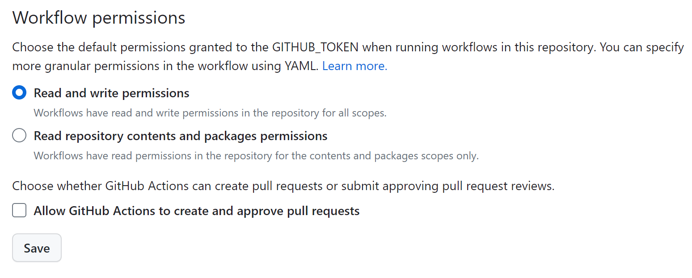

# 本站的建站过程

如你所见，本站的目前已实现的所有功能都是使用VuePress2搭建的，因此，如果你想实现本站的某个功能，一般而言只要参考官方文档即可。

本站部署在Github Page上，在“部署”这个环节，参考官网文档遇到了问题。

在此记录解决方案。

官方文档提供的git action配置文件是有误的，其中的42~51行的配置：

```yml
- name: Deploy to GitHub Pages
        uses: crazy-max/ghaction-github-pages@v2
        with:
          # 部署到 gh-pages 分支
          target_branch: gh-pages
          # 部署目录为 VuePress 的默认输出目录
          build_dir: docs/.vuepress/dist
        env:
          # @see https://docs.github.com/cn/actions/reference/authentication-in-a-workflow#about-the-github_token-secret
          GITHUB_TOKEN: ${{ secrets.GITHUB_TOKEN }}
```

执行的是将main分支构建后的文件对送到gh-pages分支的任务，但`crazy-max/ghaction-github-pages@v2`这个库有点问题，你可以改为使用更为知名的`peaceiris/actions-gh-pages@v3`这个库，将配置文件这段配置替换为如下配置即可：
```yml
- name: Build VuePress site
        run: pnpm docs:build

      # 查看 workflow 的文档来获取更多信息
      # @see https://github.com/crazy-max/ghaction-github-pages
      - name: Deploy to GitHub Pages
        uses: peaceiris/actions-gh-pages@v3
        with:
          # 部署目录为 VuePress 的默认输出目录
          github_token: ${{ secrets.GITHUB_TOKEN }}
          publish_dir: docs/.vuepress/dist
```

另外，你还需要确保你的远程仓库中，某些配置正确才可以正常部署，具体为：

在你的github仓库中，依次点击:
`Setting->Actions->General`,确保底部的`Workflow permissions`配置选择的是`Read and Write permissions`，否则在执行推送构建文件到gh-pages分支的时候会因为权限不足遇到403错误，如下图：
